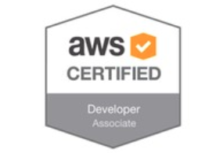

# AWS Certifications

## TOC

* [Introduction](./introduction)
	* AWS/Cloud Computing vs Tradictional Data Center
	* How to access AWS Services
	* Cloud Computing Models
	* Virtualization
	* Resourcing, Cloud Computing vs Traditional
	* Elasticity & Scalability
	* Vertical Scaling vs Horizontal Scaling
	* Shared Security Responsibility Model
* [Fundamentals (3-tier web apps)](./fundamentals)
	* [Regions](./fundamentals/regions)
	* [IAM](./fundamentals/IAM)
	* [EC2 & Security Groups](./fundamentals/EC2)
	* [ELB](./fundamentals/ELB)
	* [ASG](./fundamentals/ASG)
	* [EBS](./fundamentals/EBS)
	* [Route 53](./fundamentals/Route53)
	* [RDS](./fundamentals/RDS)
	* [ElastiCache](./fundamentals/ElastiCache)
	* [VPC](./fundamentals/VPC)
	* [S3](./fundamentals/S3)
* [Developing on AWS](./developing)
	* AWS CLI
	* AWS SDK
* [Deploying on AWS](./deploying)
	* [Elastic Beanstalk](./deploying/beanstalk)
	* CI/CD
		* [CodeCommit](./deployment/codecommit)
		* [CodePipeline](./deployment/codepipeline)
		* [CodeBuild](./deployment/codebuild)
		* [CodeDeploy](./deployment/codedeploy)
	* Infrastructure as Code
		* [CloudFormation](./deployment/cloudformation)
	* Monitoring, Troubleshooting & Audit
		* [CloudWatch](./deployment/cloudwatch)
		* [X-Ray](./deployment/xray)
		* [CloudTrail](./deployment/cloudtrail)
* [Application decoupling & integration](./integration)
* [Serverless](./serverless)
* [Always Secure](./security)
* [Other services](./other-services)