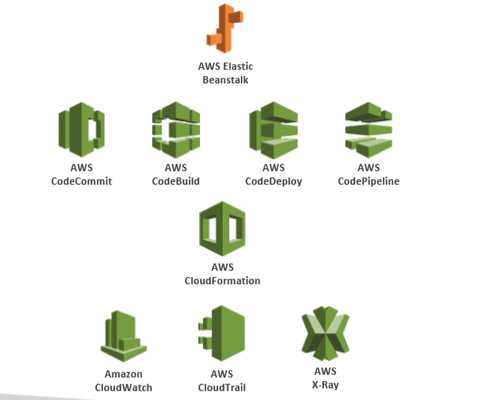

# Deploying

Deploying Propery & Continuously with Monitoring and Infrastructure as Code.

#### Developer problems on AWS

* Managing Infrastructure
* Deploying Code
* Configuring all the databases, load balancers, etc
* Scaling concerns

Most web apps have the same architecture (ALB + ASG), all the developers want is for their code ot run, if possibly, consistently across different applications and environments.