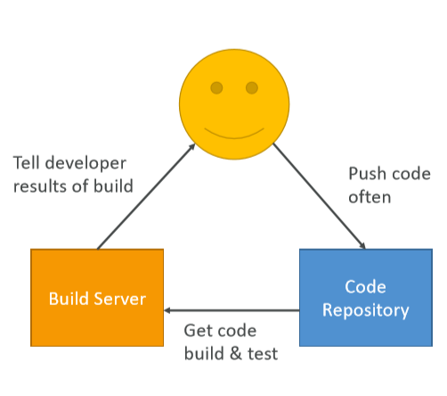
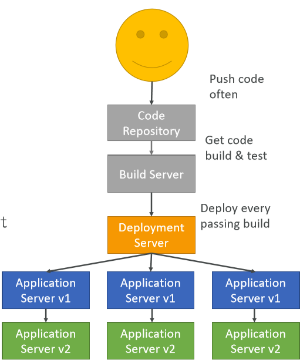

# Deploying

Deploying Propery & Continuously with Monitoring and Infrastructure as Code.

#### Developer problems on AWS

* Managing Infrastructure
* Deploying Code
* Configuring all the databases, load balancers, etc
* Scaling concerns

Most web apps have the same architecture (ALB + ASG), all the developers want is for their code ot run, if possibly, consistently across different applications and environments.

# AWS CI/CD

We'd like to push our code in a repository and have it deploed onto AWS:
* Automatically
* The right way
* Tested before deploying
* Possibility to go into different stages (dev, test, pre-prod, prod)
* Manual approval where needed

## Continuous Integration

1. Developers push the code to a code repository
    * GitHub/Gitlab
    * CodeCommit
    * Bitbucket
2. Testing/build server checks the code as soon as it's pushed
    * CodeBuild
    * Jenkins CI
3. Developers get feedback about the tests and checks that have passed/failed

This allows to:
* Find bugs early and fix them
* Deliver faster as the code is tested
* Deploy often
* Happier developers as they're unblocked

## Continuous Delivery

* Ensure software can be released reliably wenever needed.
* Ensure deployments happen often and are quick.
* Usually means automated deployment
    * CodeDeploy
    * Jenkins CD
    * Spinnaker
    * Etc...

