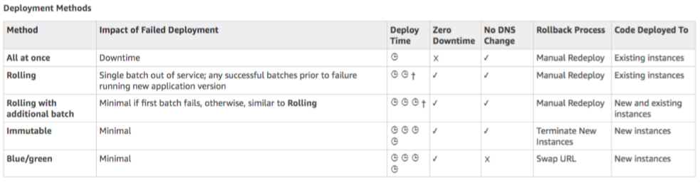

# Elastic Beanstalk

Deploying applications in AWS safely and predictably. Elastic Beanstalk is a developer centric view of deploying an application on AWS. 

It uses all the components from the fundamentals 3-tier architecture section, but all in one view that's easy to make sense of, and with full control over the configuration.

Beanstalk is __free__ but you pay for the underlying resources.

* Overview
* Three Architecture Models
* Components
* Usage
* Deployment Modes & Options
    * All at once
    * Rolling
    * Rolling with additional batches
    * Immutable
    * Blue/Green
* Extensions
* CLI
* Under The Hood
* Deployment Mechanism
* Lifecycle Policy
* Web Server vs Worker Environment
* RDS with Elastic Beanstalk

## Overview

* Managed Service
    * Instance configuraton / OS is handled by Beanstalk
    * Deployment strategy is configurable but performed by Elastic Beanstalk
* Application code is the only responsibility of the developer

## Three Architecture Models

1. __Single instance deployment__: good for devs
2. __LB + ASG__: great for production/pre-production web apps
3. __ASG only__: great for non-web apps in production (i.e. workers)

## Components

Elastic Beanstalk has three components

* Application
* Application Version (each deployment gets assigned a version)
* Environment Name (free naming)

## Usage

* You deploy application versions to environments and can promote application versions to the next environment.
* Rollback feature to previous application version
* Full control over lifecycle of environments

## Deployment Modes & Options

#### All at once

Deploy all in one go

* Fastest
* Downtime (instances aren't available to server traffic for a bit).
* Great for quick iterations in development.
* No additional cost.

#### Rolling

Update a few instances at a time (bucket), and then move onto the next bucket once the first bucket is healthy.

* Application is running below capacity
* Can set the bucket size
* Application is running both versions simultaneously
* No additional cost
* Long deployment

#### Rolling with additional batches

Like rolling, but spins up new instances to move the batch, so that the old application is still available.

* Application is running at capacity
* Can set the bucket size
* Application is running both versions simultaneously
* Small additional cost
* Additional batch is removed at the end of the deployment
* Longer deployment
* Good for production

#### Immutable

Spins up new instances in a new ASG, deploys version to these instances, and then swaps all the instances when everything is healthy.

* Zero downtime
* New Code is deployed to new instances on temporary ASG
* High cost, double capacity
* __Longest__ deployment
* Quick rollback in case of failures (just terminate new ASG)
* Great for producton

#### Blue/Green

* Not a "direct feature" of Elastic Beanstalk
* Zero downtime and release facility
* Create a new "stage" environment and deploy v2 there
* The new environment (green) can be validated indepednently and rollback if issues
* Route 53 can be setup using weighted policies to redirect a little bit of traffic to the stage environment.
* Using Beanstalk, "swap URLs" when done with the environment test.

---

## Extensions

All the parameters set in the UI can be configured with code using files.

* `.ebextensions/` directory in the root of source code
* YAML/JSON
* `.config` extensions
* Able to modify some defautl settings using: option_settings
* Ability to add resources such as RDS, ElastiCache, DynamoDB, etc...

Resources managed by `.ebextensions` get deleted if the environment goes away.

## CLI

We can install the additional "EB CLI" which makes working with Beanstalk from the CLI easier and is helpful for automated deployment pipelines!

Basic commands `eb`:
* create
* status
* health
* events
* logs
* open
* deploy
* config
* terminate

## Under the Hood

Elastic Beanstalk relies on __Cloud Formation__.

## Deployment Mechanism

* Describe dependencies (requirements.txt for Python, package.json for Node.js)
* Package code as zip
* Zip file is uploaded to each EC2 machine
* Each EC2 machine resolves dependencies (SLOW)
* Optimization in case of long deployments: Package dependencies with source code
* HTTPS for Beanstalk
    * Load SSL certificate onto the Load Balancer
    * Can be done from EB Console -> Load Balancer configuation
    * Can be done from the code -> .ebextensions/securelistener-alb.config
    * SSL Certificate can be provisioned using AWS Certificate Manager or CLI
    * Must configure a security group rule to allow incoming port 443
* Redirect HTTP to HTTPS
    * Configure instances OR ALB (Applican Load Balancer only) with a rule
    * Make sure health checks are not redirected (so they keep giving 200 OK)

## Lifecycle Policy

* Can store at most 1000 applications versions
* If you don't remove old versions, you won't be able to deploy anymore
* To phase out old applications versions, use a __lifecycle policy__
    * Based on time
    * Based on space
* Versions that are currently used won't be deleted
* Option not to delete the source bundle in S3 to prevent data loss

## Web Server vs Worker Environment

If your application perorms tasks that are long to complete, offload these tasks to a dedicated __worker environment__.

__Decoupling__ your application into two tiers is common.

You can define periodic tasks in a file `cron.yaml`.

