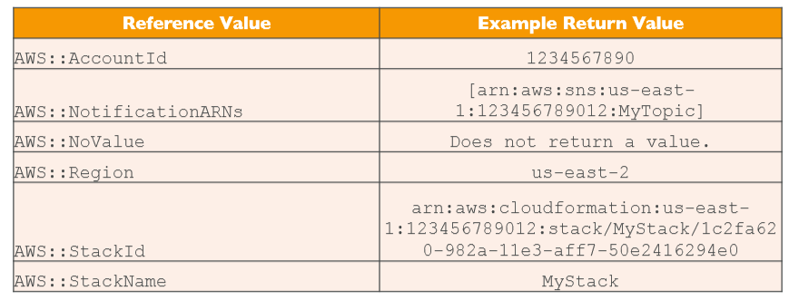

# CloudFormation

> Managing your infrastructure as code

CloudFormation is a declarative way of outlining your AWS Infrastructure, for any resources (most of them are supported).

For example, within a CloudFormation template, you say:
* I want a security group
* I want two EC2 machines using this security group
* I want two Elastic IPs for these EC2 machines
* I want an S3 Bucket
* I want an ELB in front of these machines

Then CloudFormation creates those for you, in the __right order__, with the __exact configuraton__ that you specify.

We'll cover:
* Benefits
* How it works
* Deployment
* Building Blocks

## Benefits

* Infrastructure as code
    * No resources manually created
    * Code can be version controlled
    * Changes to the infrastructure are reviwed through code
* Cost Transparency
    * Each resource within the stack is tagged with an identifier and is easy to see how much a stack costs you
    * You can estimate the costs of your resources using CloudFormation template
    * Saving strategy: you could automation deletion of templates and recreation at specific times, safely.
* Productivity
    * Ability to destroy and re-create an infrastructure on the cloud on the fly
    * Automated generation of Diagram for your templates
    * Declarative programming (no need to figure out ordering and orchestation)
* Separation of concerns
    * Create many stacks for many apps and many layers
* Don't re-invent the wheel
    * Leverage existing templates on the web
    * Leverage the documentation

## How it works

* Templates have to be uploded in S3 and then referenced in CloudFormation
* To update a template, we need to upload a new version
* Stacks are identified by a name
* Deleting a stack deletes every single artifact that was created by CloudFormation

## Deployment

* Manual
    * Editing templates in the CloudFormation Designer
    * Using the console to input parameters
* Automated
    * Editing templates in a YAML file
    * Using AWS CLI to deploy templates
    * Recommended way when you fully want to automate your flow

## Building Blocks

* Templates Components
    * Resources: AWS resources declared in templates, can reference each other
    * Parameters: dynamic inputs
    * Mappings: static variables
    * Outputs
        * Cross Stack Reference
    * Conditionals
    * Metadata
* Template Helpers
    * References
    * Functions

#### Resources

AWS figures out creation, updates and deletes of resources for us.

Resource types identifiers are of the form:

```
AWS::aws-product-name::data-type-name
```

Here's the [documentation for all type of resources](https://docs.aws.amazon.com/AWSCloudFormation/latest/UserGuide/aws-template-resource-type-ref.html).

Must to know:
* Can I create a dynamic amount of resources?
    * No! Eveything in the CloudFormation template has to be declared.
* Is every AWS Service supported?
    * Almost. You can work around using AWS Lambda Custom Resources.

#### Parameters

Parameters are a way to provide inputs to your AWS CloudFormation template.

Important to know if:
* You want to __reuse__ templates across the company
* Some inputs can not be determined ahead of time.

```yaml
Parameters:
    SecurityGroupDescription:
        Description: Security Group Description (Simple parameter)
        Type: String
```

How to reference a parameter?
* The `Fn::Ref` function can be leveraed to reference parameters.
* Parameters can be used anwhere in a template
* Shorthand for this in YAML is `!Ref`

```yaml
DbSubnet1:
    Type: AWS::EC2::Subnet
    Properties:
        VpcId: !Ref MyVPC

```

AWS offer us __Pseudo Parameters__ that can be used at any time and are enabled by default.




#### Mappings

Fixed variables within your CF Template. Very handy to differentiate environments, regions, AMI types, etc...

```
RegionMap:
    us-east-1:
        "32": "ami-6411e20d"
        "64": "ami-7a11e213"
    ...
```

You use `Fn::FindInMap`/`!FindInMap` to return a named value from a specific key

```yaml
Resources:
    myEC2Instance:
        Type: "AWS::EC2::Instance"
        Properties:
        ImageId: !FindInMap [RegionMap, !Ref "AWS::Region", 321]
        InstanceType: m1.small
```

#### Outputs

Declares __optional__ outputs values that we can improt into other stacks (if you export them first) or view them in the AWS Console/CLI.

It's the best way to perform some __collaboraiton cross stack__ as you let expert handle their own part of the stack.

You can't delete a CloudFormation Stack if its outputs are being referenced by another CloudFormation stack.

Examples:
* SSH Security Group
* Create an output that references that security group

```yaml
Outputs:
    StackSSHSecurityGroup:
        Description: The SSH Security group for our company
        Value: !Ref MyCompanyWideSSHSecurityGroup
        Export:
            Name: SSHSecurityGroup
```

#### Cross Stack Reference

If we create a second template, we haven use the function `Fn::ImportValue`. Remember you can't delete the underlying sack until all the references are deleted too.

```yaml
Resources:
    Type: AWS::EC2::Instance
    Properties:
        AvailabilityZone: us-east-1a
        ImageId: ami-a4c7edb2
        InstanceType: t2.micro
        SecurityGroups:
            - !ImportValue SSHSecurityGroup
```

#### Conditions

Control the creation of resources or outputs based on a condition. They can be whatever you want and reference another condition, parameter value or mapping but common ones:
* Environment
* AWS Region
* Any parameter value

```yaml
Conditions:
    CreateProdResource: !Equals [ !Ref EnvType, prod ]
```
The intrisic function can be any of the following `Fn::<function>`:
* And
* Equals
* If
* Not
* Or

Conditions can be applied to resources/outputs/etc:

```yaml
Resources:
    MountPoint:
        Type: "AWS::EC2::VolumeAttachment"
        Condition: CreateProdResources
```

## Intrinsic Functions

```
Ref -> reference parameter/resource
!GetAtt -> attributes of resources
!FindInMap [MapName, TopLevelKey, SecondLevelKey] -> return named value from a specifi key
!ImportValue -> import values from other templates' output
!Join -> Join values with a delimiter
!Sub -> substitute variables from a text
!If !Not !Equals !And !Or
```

## Rollbacks 

* Stack Creation Fails
    * Default: everything rolls back (get deleted), we can look at the log
    * Option to disable rollback and troubleshoot
* Stack Update Fails:
    * The stack automatically rolls back to the previous known working state
    * Ability to see in the log what happened and error messages