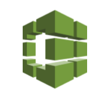
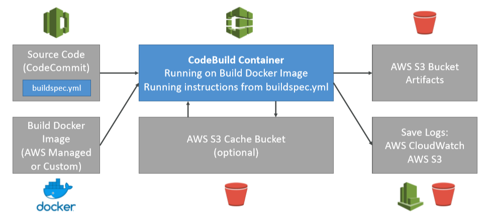

# CodeBuild

> Building and testing our code.

* Overview
* Usage
* How it works

## Overview

* Fully managed build service
* Continuous Scaling (no servers to manage or provision, no build queue)
* Pay for usage, the time it takes to complete the builds
* Leverages Docker under the hood for reproducible builds
* Possibility to extend capabilities leveraging our own base Docker images
* __Secure__: integration with KMS for encryption of build artifacts, IAM for build permissions, VPC for network security, and CloudTrail for API calls logging

## Main usage

* Build instructions can be defined in code (`buildspec.yml`)
* Environment variables
    * Plaintext
    * Secure secrets: SSM PArameter store
* Phases
    * Install
    * Pre-build
    * Build
    * Post build
* Artifacts
* Cache (usually dependencies) to S3 for future build speedup

## Additional usages

* Output logs to Amazon S3 & AWS CloudWatch logs
* Metrics to monitor CodeBuild statistics
* CloudWatch Events to detect failed builds and trigger notificatosn
* CloudWatch Alarms to notify if you need "tresholds" for failures
* CloudWatch Events / AWS Lambda as a Glue
* SNS Notifications
* Ability to reproduce CodeBuild locally to troubleshoot in case of errors, for this leverage the _CodeBuild Agent_
* Builds can be defined with CodePipeline or CodeBuild itself

## How it works

