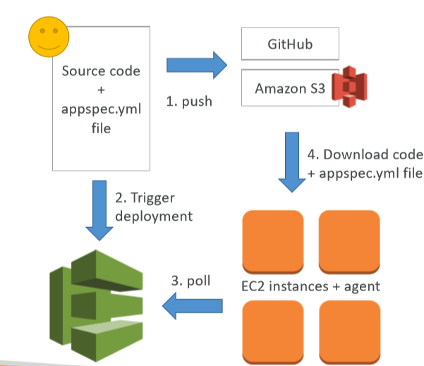

# CodeDeploy

> Deploying the code to EC2 fleets (not Beanstalk).

We want to deploy our application automatically to many EC2 instances that are not managed by Elastic Beanstalk. We can used the managed service AWS CodeDeploy.

Other open source alternatives are
* Ansible
* Terraform
* Chef
* Puppet

We'll cover:
* Usage
* Other details
* Components
* AppSpec (Deploy & Hooks Order)
* Deployment Config

## Usage

* Each EC2 machine (or On Premise) must be running the _CodeDeploy Agent_
* Agent is continuously polling AWS CodeDeploy for work to do
* CodeDeploy sends `appspec.yml` file
* Application is pulled from repository
* EC2 will run the deployment instructions
* CodeDeploy Agent will report of success/failure of deployment on the instance

## Other details

* EC2 instances are grouped by deployment group (dev/test/prod)
* Lots of flexibility to define any kind of deployments
* CodeDeploy can be chained into CodePipeline and use artifacts from there
* CodeDeploy can re-use existing setup tools, works with any applicaton, auto scaling integration
* Note: Blue/Green only works wit EC2 instances (not On Premise)
* Support for AWS Lambda deployments
* CodeDeploy does not provision resources

## Primary Components

* __Application__: unique name
* __Compute platform__: EC2/On-Premise or Lambda
* __Deployment configuration__: Deployment rules for succes/failures
    * EC2/On-Premise: minimum number of healthy instances
    * AWS Lambda: how traffic is routed to your updated Lambda function verions
* __Deployment group__: group of tagged instances
* __Deployment type__: In place or Blue/Green
* __IAM instance profile__: Need to give EC2 permissions to pull from S3 / Repository
* __Aplication Revision__: application code + `appspec.yml` file
* __Service Role__: Role for CodeDeploy to perform what it needs
* __Target Revision__: Target deplyoment application version

## AppSpec

* __File Section__: how to source and copy from S3 / Repository to filesystem
* __Hooks__: set of instructions to do to deploy the new version (hooks can have timeouts)
    1. ApplicationStop
    2. DownloadBundle
    3. BeforeInstall
    4. AfterInstall
    5. ApplicatonStart
    6. __ValidateService__
    7. BeforeAllowTraffic
    8. AllowTraffic
    9. AfterAllowTrafic

## Deployment Config

* __Configs__
    * One at a time (one instance fails, deployment stops)
    * Half at a time
    * All at once (downtime)
    * Custom (min healthy host)
* __Failures__
    * Instances stay in "failed state"
    * New deployment will first be deployed to "failed sate" instance
    * To rollback, redeploy old deployment or enale automated rollback for failures
* __Deployment Targets__
    * Set of EC2 instances with tags
    * Directly to an ASG
    * Mix of ASG / Tags so you can build deployment segments
    * Customization in scripts with DEPLOYMENT_GROUP_NAME environment variables