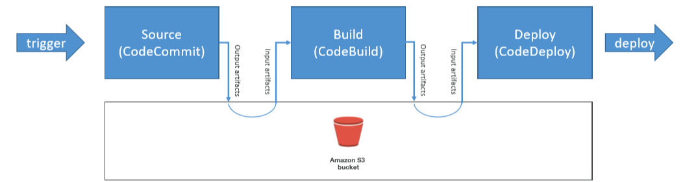

# CodePipeline

> Automating our pipeline from code to ElasticBeanstalk.

* Overview
* Artifacts
* Troubleshooting

## Overview

* Visual workflow made of stages (build, test, deploy, loadtest, etc...)
    * Each stage can have sequential/parallel actions
    * Manual approval can be defined at any stage
* Source
    * CodeCommit / Github / S3
* Build
    * CodeBuild / Jenkins / etc
* Load Testing
    * 3rd party tools
* Deploy:
    * AWS CodeDeploy / Beanstalk / CloudFormation / ECS

## Artifacts

Each pipeline stage can create "_artifacts_" that are stored in AWS S3 and passed on to the next stage.

## Troubleshooting

* CodePipeline state changes happen in __AWS CloudWatch Events__, which can in return create SNS notifications.
* If CodePipeline fails a stage, your pipeline stops and you can get information in the cnosole.
* __AWS CloudTrail__ can be used to audit AWS API calls.
* If CodePipeline can't perform an action, make sure the "IAM Service Role" attached does have enough permissions (IAM Policy).