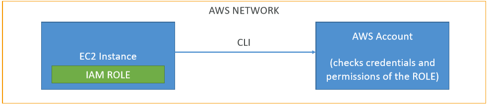

# Developing with AWS

* How to perform interaction with AWS without using the Online Console?
    * CLI on local/EC2 machines
    * SDK on local/EC2 machines
    * AWS Instance Metadata Service for EC2
* How to interact with AWS Proprietary services? (S3, DynamoDB, etc...)
    * SDK
* Credentials Security

## CLI

* We access the AWS Network over www, using our credentials and permissons
    * AWS Access Key
    * AWS Secret Key

#### CLI on EC2

* NEVER PUT PERSONAL CREDENTIALS ON AN EC2
    * EC2 compromised -> your personal account too
    * EC2 shared -> people may perform AWS actons while impersonating you
* Use AWS IAM Roles for EC2
    * Can be attached to EC2 instances
    * Can use a policy authorizing exactly what the EC2 instance should be able to do



#### CLI Dry Runs

Sometimes, we'd just like to make sure we have the permissions without actually running the commands.

* Some AWS CLI commands (such as EC2) can become expensive if they succeed.
* Some AWS CLI commands contain a `--dry-run` option to simulate API calls.

#### CLI STS Decode Errors

When you run API calls and they fial, you can get a long error message. This can be decoded using the __STS__ command line:

```
sts decode-authorization-message
```

#### EC2 Instance Metadata

It allows EC2 instances to "_learn about themselves_" without using an IAM Role for that purpose. You can retrieve the IAM Role name from the metadata, but you cannot retrieve the IAM Policy.

```
http://<ec2_public_ip>/latest/meta-data
```

* Metadata = Info about the EC2 instance
* Userdata = launch script of the EC2 instance

## AWS SDK

You can perform actions on AWS directly from your application code without using the CLI.

You need to use AWS SDK when coding against AWS Services such as DynamoDB.

__Good to know__: if you don't specify/cofigure a default region, then `us-east-1` will be chosen by default.

#### SDK Credentials Security

* It's recommended to use the __default credential provider chain__, that works seamlessly with:
    * AWS Credentials at `~/.aws/credentials`
    * Instance Profile Credentials using IAM Roles (__use this if working from AWS Services__)
    * Environment variables (AWS_ACCESS_KEY_ID & AWS_SECRET_ACCES_KEY)
* Overall, never store aws credentials in your code.

#### Exponential Backoff

Any API that fails because of too many cals needs to be retried with Exponential Backoff, these apply to rate limited API. Retry mechanism included in SDK API calls