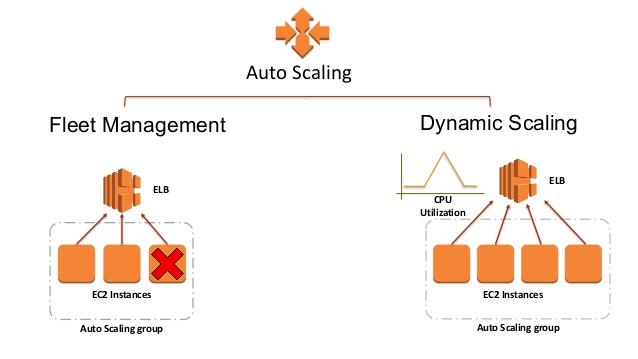
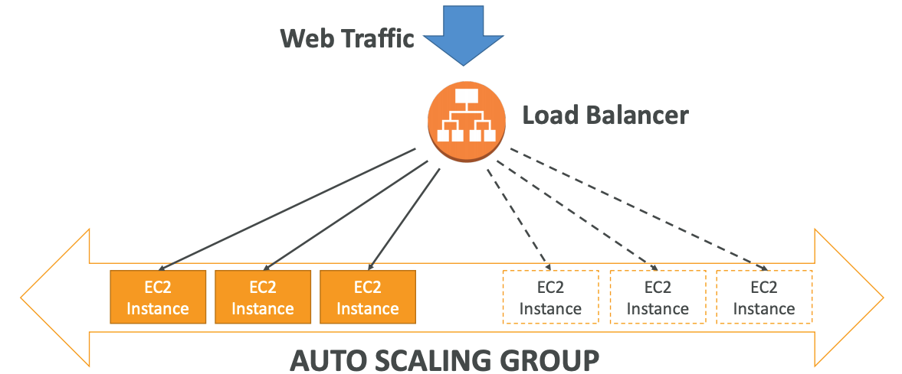
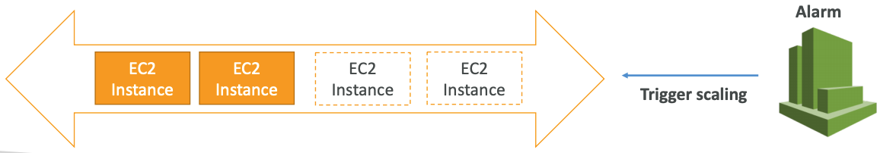

# ASG - Auto Scaling Group

#### Must know

* What ASG Offers?
* Attributes.
* CloudWatch Alarms
	* Rules & Custom Metrics
* Summary

## What ASG offers?

* Scale out to match an increased load.
* Scale in to match a decreased load.
* Ensure we have a minimum and maximum number of machines number.
* Automatically register new instances to a Load Balancer.

## Attributes

* Launch configuration
	* AMI + Instance Type
	* EC2 User Data
	* EBS Volumes
	* Security Groups
	* SSH Key Pair
* Min/Max Size
* Initial Capacity
* Network + Subnets information
* Load Balancer information
* Scaling Policies

## CloudWatch Alarms

You can scale an ASG based on CloudWatch alarms that monitors a metric (such as average CPU usage). Metrics are computed for the overall ASG instances.

Based on the alarms, you can declare Scaling Policies for _scale-out_ and _scale-in_.

#### Auto Scaling New Rules

Better auto scaling rules that are __directly managed by EC2__.
* Target Average CPU Usage
* Number of requests on the ELB per instance
* Average Network In/Out

#### Custom Metrics

* Scaling can be done based on a custom metric (ex: connected users).
* PutMetric API.
* Create CloudWatch Alarm to react as the scaling policy for ASG.

## Summary

* IAM roles attached to an ASG will get assigned to EC2 instances.
* ASG are __free__, you pay for underlying resources being launched.
* Instances under an ASG terminated will get restarted! __Extra safety__.
* ASG can terminate instances marked as unhealthy by a Load Balancer and replace them.
