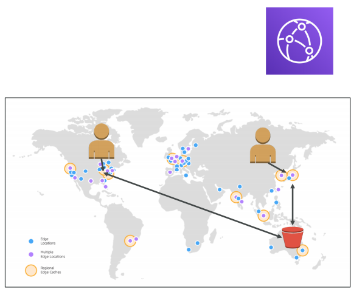
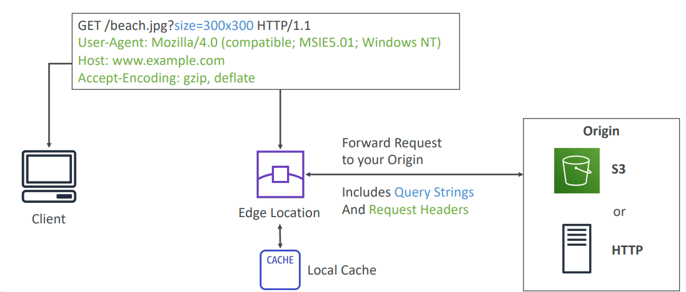
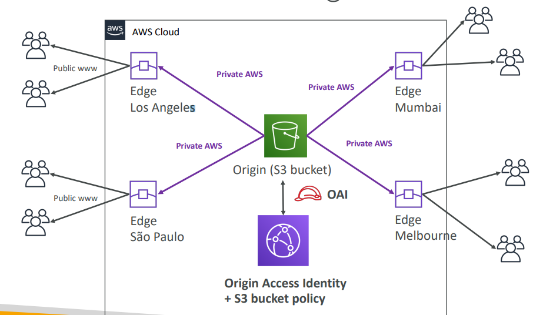
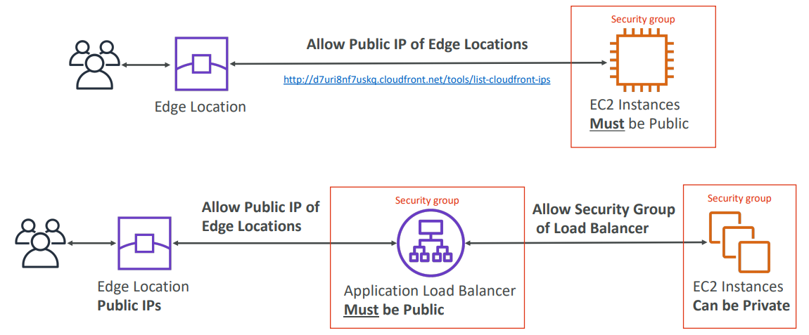
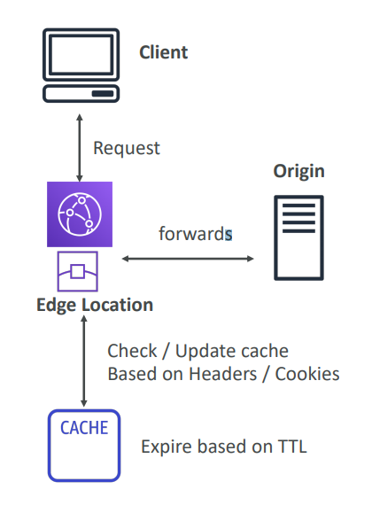
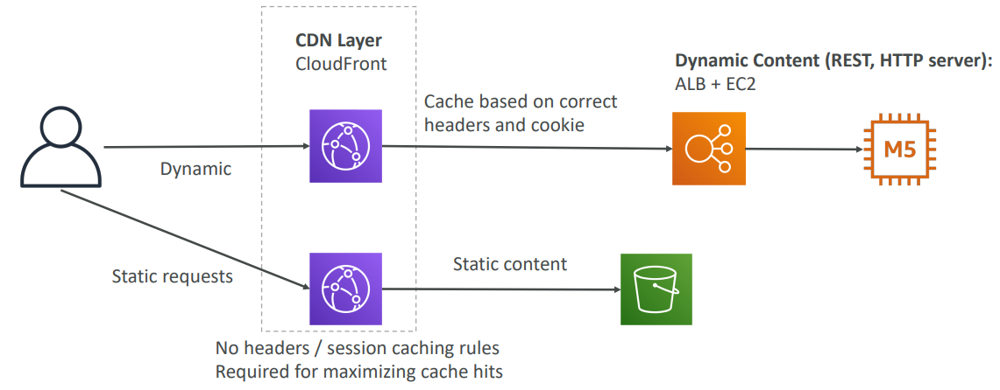
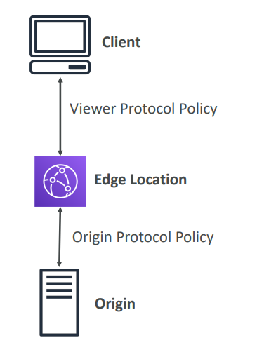
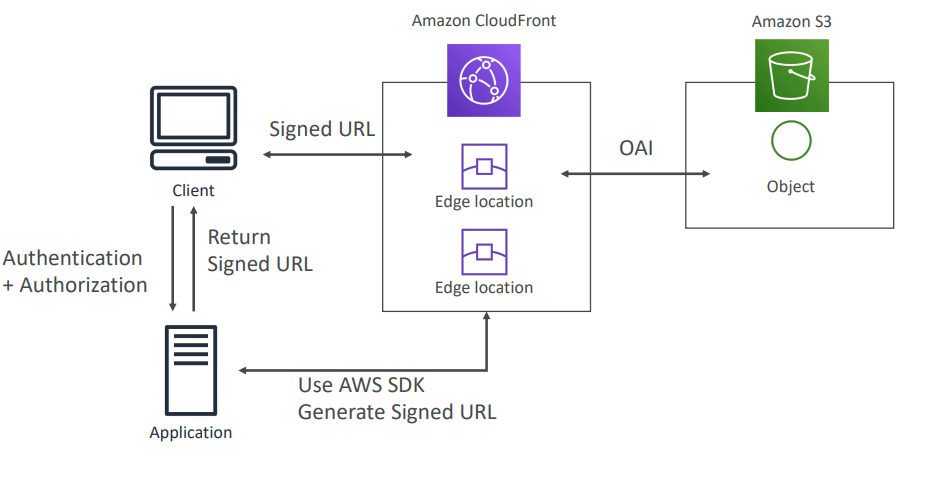
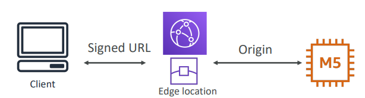
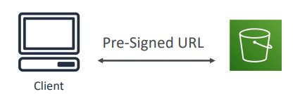

# CloudFront

Content Delivery Network (CDN) that improved read performance by caching at multiple edge locations (216 Point of Presence Globaly.)

It comes with DDoS Protection, integration with _Shield_ AWS Web Application Firewall. 

Can expose external HTTPS and talk to internal HTTP backends.

* Origins
  * S3
  * ALB/EC2 (Custom backend)
* Geo Restriction
* CloudFront vs S3 Cross Origin Replication
* Caching
* Cloudfront and HTTPS
* Signed URL / Signed Cookies
* CloudFront Signed URL vs S3 Pre-Signed URL

## High Level Cloud Front

## Origins

* __S3 Bucket__
  * Distribute files and cache them at edge locations
  * Enhanced security with CloudFront's __Origin Access Identity__ (OAI)
* __Custom Origin (HTTP)__
  * Application Load Balancer
  * EC2 Instance
  * S3 Website (must first enable bucket as a static S3 website)
  * Any HTTP backend you want

### S3 as an Origin

### ALB/EC2 as an Origin

## Geo Restriction

You can restrict who can access your distribution based on a 3rd party Geo-IP database:

* __Whitelist__: allow access only if they're in one of the countries on a list of approvec countries.
* __Blacklist__: prevent your users from accessing your content if they're in one of the cuntries on a blacklist of banned countries.

## CloudFront vs S3 Cross Region Replication

CloudFront:
* Global Edge Network
* Files are cached for a TTL - Time to Live (maybe a day)
* __Great for static content that must be available everywhere__

S3 Cross Region Replication:
* Must be setup for each region you want replication to happen
* Files are updated in near real-time
* Read only
* __Great for dynamic content tat needs to be available at low-latency in a few regions__

## CloudFront Caching

Cache based on:
* Headers
* Session Cookies
* Query String Parameters

The cache lives __at each CloudFront Edge Location__.

You want to __maximize the cache hit rate__ to minimize requests on the origin.
* Control the TTL (0 seconds to 1 year)
* Set by the origin using the `Cache-Control` header, `Expires` header
* Invalidate part of the cache using the _CreateInvalidation_ API.

### Maximize Cache Hits

One way is separating static and dynamic distributions.

## CloudFront and HTTPS

Viewer Protocol Policy:
* Redirect HTTP to HTTPS
* HTTPS only

Origin Protocol Policy (S3/Custom Origin):
* HTTPS only
* Or Match Viewer

Note: __S3 Bucket "websites" don't support HTTPS__.

## Signed URL / Signed Cookies

If you want to distribute paid shared content to premim users over the world, you can __Restrict Viewer Access__ by creating a CloudFront Signed URL / Cookie.

How long should the URL be valid for?
* Shared Content (music, movies): a few minutes
* Private Content (private to the user): you can make it last for years

Signed URL give access to individual files (one signed URL per fle), while Signed Cookies give access to multiple files (one signed cookie for many files)

## CloudFront Signed URL vs S3 Pre-Signed URL

CloudFront Signed URL:
* Allow access to a path, no matter the origin
* Account wide key-pair, only the root can manage it
* Can filter by IP, path, date, expiration
* can leverage caching features

S3 Pre-Signed URL:
* Issue a request as the person who pre-signed the URL
* Uses the IAM key of the signing IAM principal
* Limited lifetime

