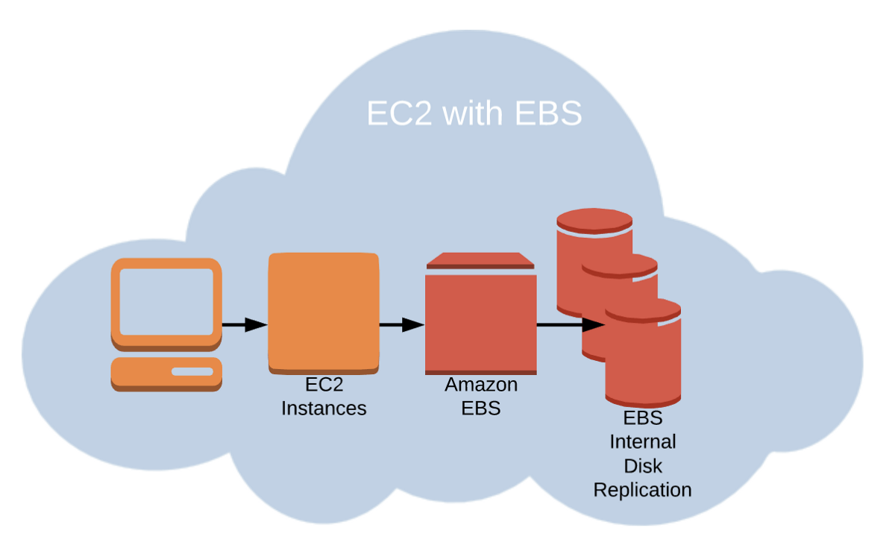

# EBS - Elastic Book Store

* __Network__ drive you can attach to your instances (one at a time) to persist data.
* Might be a bit of latency as uses network to communicate.
* Can be detached from EC2 instances and attached to another one quickly.
* __Locked to AZ__ for attachments, you can move them using _snapshots_.
* Have a __resizable__ provisioned capacity (GBs and IOPS).
	* IOPS only in IO1.
	* Need repartition after resizing.

#### ToC

* Volume Types
* Snapshots
* Encryption
* EBS vs Instance Store
* EBS vs EFS vs S3
* Brain Dump

## Volume Types

#### GP2 (SSD)

General purpose that balances price and performance.

#### IO1 (SSD)

Highest performance for mission-critical low-latency or high-throughput workloads.

#### STI (HHD)

Low cost HDD for frequently accessed, throughput intensive workloads.

#### SCI (HDD)

Lowest cost HDD volume designed for less frequently accessed workloads.

## Snapshots

* Only take the actual space of the blocks on the volume.
* Backups
* Volume migration
	* Resizing
	* Change AZ
	* Encryption

## Encryption

* Can create an encrypted EBS volume with the following:
	* Data at rest encrypted
	* All data in flight moving between instance and volume is encrypted
	* All snapshots are encrypted
	* All volumes created from the snapshots are encrypted
* Encryption and decryption are handled transparently (you do nothing).
* EBS Encryption leverages keys from KMS (AES-256)
* Copying an unencrypted snapshot allows encryption.

## EBS vs Instance Store

* Instance Store has better I/O performance because it's a __phyisical driver attached to your phyisical server__.
* On termination, Instance Store is lost.
* Can't resize Instance Store.
* Instance Store's Backups must be operated by the user.

## EBS vs EFS vs S3

The main difference is that EBS is __only acessible from one instance at a time in your particular AWS Region__.

* EFS allows for multiple instances and regions.
* S3 is not limited to EC2 and can be accessed directly or from other AWS Services.

## Brain Dump

* EBS can be attached to only one instance at a time.
* EBS are locked at AZ level.
* Migrating EBS volume across AZ means taking a snapshot and recreating it in the other AZ.
* EBS backups use I/O and should not be run while application is handling a lot of traffic.
* Root EBS Volumes of instances get terminated by default if the EC2 instance gets terminated (can be disabled).
