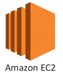
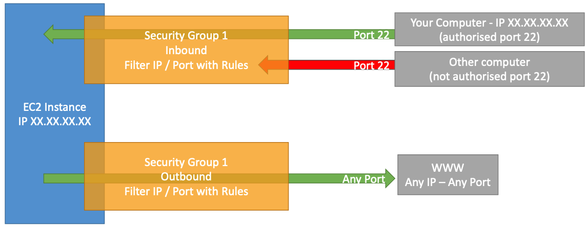
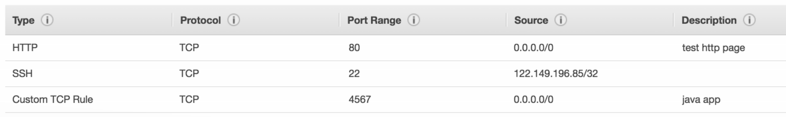
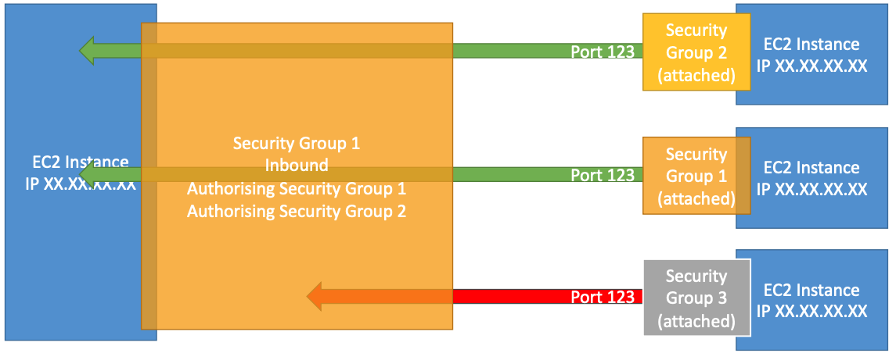
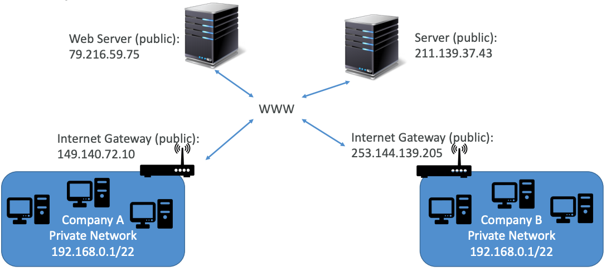

# EC2 - Elastic Cloud Computing

#### TOC

* Security Groups & Best practices
* Private vs Public IP (IPv4)
* Static vs Elastic IP
* EC2 User Data
* AMIs
* Launch types
* Pricing
* Instances overview

#### Must know

* How to SSH and troubleshoot `.pem` file permissions.
* How to properly use Security Groups.
* Fundamentals differences between Private and Public IP.
* How to use User Data to customize your instance at boot time.
* Build custom AMI to enchance your OS.
* EC2 instance billed by the second and can be easily thrown away.

#### Basic Cloud Architecture Overview

* __EC2__: Renting virtual machines
* __EBS__: Storing data on virtual drives
* __ELB__: Distributing load across machines
* __ASG__: Scaling the services

## Security Groups

Control how traffic is allowed into or out our EC2 Machines. It's a fundamental skill to troubleshoot networking issues.

* Access to ports
* Authorised IP ranges - IPv4 and IPv6
* Control of Inbound network (other to instance)
* Control of Outbound network (instance to other)

#### Example configuration

## Security Groups - Best Practices

* Can be attached to multiple instances.
* Locked down to region / VPC.
* Lives “_outside_” EC2 - instance won’t see blocked traffic.
* It’s good to maintain one separate security group for SSH.
* Application not accessible (timeout) means security group issue.
* Application “connection refused” means application error or not launched.
* All inbound traffic is blocked by default.
* All outbound traffic is authorized by default.
* Can reference to other security groups.

## Public vs Private IP

By default EC2 machine comes with:
* Private IP for internal AWS Network.
* Public IP __that may change on restarts__.

#### IPv4 and IPv6

Networking has two sorts of IPs:
* IPv4: 1.160.10.240
* IPv6: 3ffe: 1900:4545:3:200:f8ff:fe21:67cf

#### Public IP

* Machine can be __identified on the internet__
* Must be unique across the whole web (easily geo-located)

#### Private IP

* Machine can only be __identified on a private network__
* Must be unique across private network
* Machines connect to WWW using an internet gateway (proxy)
* Only a specified range of IPs can be used as private IP

#### Elastic IP

EC2 instance can change its public IP on restart, Elastic IP provides you a way to use a __fixed public IP__.

* You can attach it to one instance at a time.
* Mask the failure of an instance by rapidly remapping the address to another instance.
* By default you can have __5 Elastic IP at most__ (may contact AWS to increase it).
* Overall, __try to avoid using Elastic IP__:
	* Often reflects poor architectural decisions.
	* Instead, use a random public IP and register a DNS name to it.
	* Instead, use a Load Balancer and don't expose instance public ips.

## EC2 User Data

Script that only run once at the instance first start.

* Bootstrap your instances
* Runs with the root user

## AMI - Amazon Machine Images

AMI provides the information required to launch an instance. You can easily launch multiple instances from a single AMI when you need multiple instances with the same configuration.

AWS comes with base images such as Ubuntu, Fedora, RedHat, Windows, etc... Those images can be customized at runtime.

Also, you can search for AMIs provided by the community.

An AMI includes the following:
* 1 or more EBS snapshots or, a template for the root volume of the instance.
* Launch permissions that control which accounts can use the AMI.
* A block device mapping that specifies the volumes to attach to the instance when launched.

#### AMI Good-To-Know

* AMIs are __built for specific AWS regions__.
* You can copy AMIs within regions and deregister them when no longer needed.
* Pre-installed packages needed, including monitoring/enterprise software.
* Faster boot thime than EC2 User Data.
* Security policies
* Control of maintenance and updates of AMIs over time it's important.
* Active Directory integration out of the box.
* You can install your apps ahead of time (faster deploys when auto-scaling).
* Use community's AMI that is optimized for running your software.

#### Creating your own AMI

You can launch an instance from an existing AMI, customize the instance, and __then save this updated configuration as a custom AMI__.

The root storage device can be either:
* EBS volume.
* Instance store volume.

Also, AMIs can be:
* Shared or private

Also, AMIs can be:
* Shared or private.
* Buy/Sell.

## Instance Launch Types

#### On Demand

* Short workload, predictable pricing.
* Pay what you use (billing per second).
* Highest cost but no upfront payment.
* Short-term and un-interrumpted workloads that can’t be predicted.

#### Reserved

* Long workloads (1-3 years).
* Up to __75%__ discount compared to On Demand.
* Stead usage applications (like database).

#### Convertible Reserved

* Can change EC2 instance type
* Up to __~50%__ discount.

#### Scheduled Reserved

* Launch within time window you reserve.

#### Spot Instances

* Short workloads for cheap.
* Can lose instances.
* Up to __90% discount__ compared to On Demand.
* Bid a price and get the instance as long as its under the price, varies on offer and demand.
* Spot instances are reclaimed with a 2 minute notification warning when spot price goes above your bid.
* Great for Batch jobs, Big Data analysis or workloads that are resilient to failures.

#### Dedicated Instances

* No other customers will share your hardware.
* Share hardware with other instances in same account.
* No control over instance placement (can move hardware after Stop / Start).

#### Dedicated Hosts

* Book an entire physical server, control instance placement.
* Visibility into underlying sockets / physical cores of the hardware.
* More expensive.
* Useful for software that have complicated licensing model.
* BYOL - Bring your Own License.
* Companies with strong regulatory or compliance needs.

## EC2 Pricing

* Instance prices (per hour) varies based on:
	* Region.
	* Instance Type.
	* Launch Type.
	* Linux vs Windows vs Private OS.
* Instances are __billed by second__ with a minimum of 60 seconds.
* Bear in mind you pay for other factors such as storage, fixed IP, load balancing, etc.
* __You do not pay for the instance if it is stopped__.

## Instance Overview

Instances have __5 distinct characteristics__ advertised:
* RAM (type, amount, generation).
* CPU (type, make, frequency, generation, cores).
* I/O (disk performance, EBS optimizations).
* Network (bandwith, latency).
* GPU.

We can categorize instances based on these characteristics:
* R/C/P/G/H/X/I/F/Z/CR are specialized in those 5 characteristics
* M types are balanced
* T2/T3 types are “burstable”

#### T2 - Burstable instances

They have decent overall CPU performance, but when machine needs to process something unexpected, it can burst and CPU performance be VERY good.

* If machine bursts, it utilizes "_burst credits_".
* If all credits are gone, CPU performance becomes bad.
* Credits are accumulated over time while machine is not bursting.

They are amazing to handle __unexpected traffic__.

If an instance consistently runs low on credit, you might need to move to a different kind of _non-burstable_ instance.

#### T2 Unlimited

Burstable instance with __unlimited burst credit balance__ by paying extra money if you go over credit balance.
