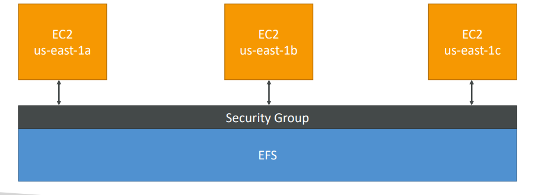

# EFS - Elastic File System

Managed NFS (network file system) that can be mounted on multiple EC2 in multi-AZ.

* Highly available
* Scalable (automatically, no capacity planning!)
  * Grow to Petabyte-scale network file system, automatically
* Pay per use
* Storage Tiers
  * Standard: for frequently accessed files
  * Infrequent Access (EFS-IA): cost to retrieve files, lower price to store
* Performance modes set at EFS creation time
  * General purpose (latency-sensitive use cases, for web server, CMS, etc)
  * Max I/O (highly parallel, for big data, media procesing)
* Expensive (3 times a gp2)
* Uses NFSv4.1 protocol
* Uses Security Group to control access to EFS
* POSIX file system, with standard file API
* Compatible with Linux based AMI (not Windows)
* Encryption at rest using KMS

#### Usages

* Content Management
* Web Serving
* Data Sharing
