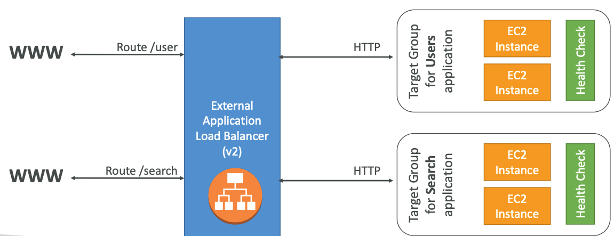
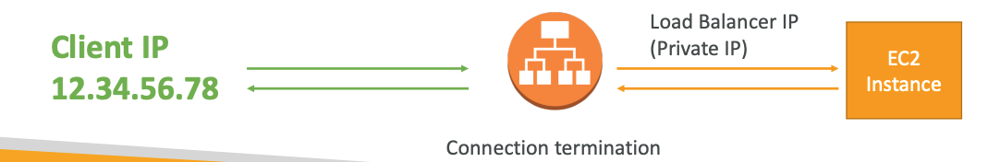
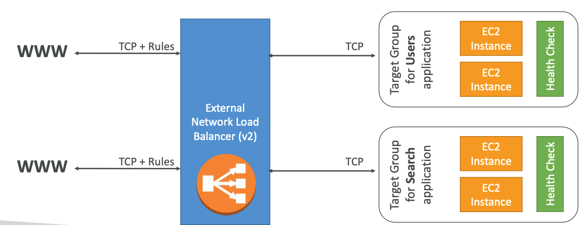

# ELB - Elastic Load Balancing

#### Must know

* Load Balancing
* Health Checks
* What ELB Offers?
* Types of ELB
* Summary

## Load Balancing

* Servers that forward traffic to multiple servers downstream.
* Spread load across multiple downstream instances.
* Expose a single point of access (DNS) to your application.
* Seamlessly handle failures of downstream instances (health checks).
* Provide SSL termination (HTTPS) for your websites.
* Enforce stickiness with cookies.
* High availability across zones.
* Separate public traffic from private traffic.

## Health Checks

* Load balancers may know if instances it forwards traffic to are available to reply to requests.
* Health check is done on a port and on a route.
* If response is not 200, then instance is unhealthy.

## What ELB Offers?

* Managed Load Balancer:
	* AWS guarantees that it will be working.
	* AWS takes care of upgrades, maintenance and high availability.
	* AWS provides only a few configuration knobs.
* Cost less to setup own load balancer but it will be a lot more effort.
* Integrated with many AWS Services.

---

## Types

* Classic Load Balancer (_deprecated_).
* Application Load Balancer.
* Network Load Balancer.
* Internal (private) ELB.
* External (public) ELB.

### Application Load Balancer

* Awesome for micro-services & container-based application.
* Port mapping feature to redirect to a dynamic port.
* Allows load balancing:
	* To multiple HTTP applications across machines (target groups).
	* To multiple applications on same machine (i.e, containers).
	* Bases on route in URL.
	* Based on hostname in URL.
* _Stickiness_ (same client requests goes to same instance) can be enabled at target group level and is directly generated by ALB.
* Support HTTP/HTTPS & Websocket protocols.
* Don't see the IP of the client directly.
	* True IP of the client is inserted in the header `X-Forwarded-For`.
	* We can also get Port (`X-Forwared-Port`) and protocol (`X-Forwared-Proto`).
* ~400ms latency.

	
### Network Load Balancer

* Mostly used for _extreme performance_.
* Should not be the default Load Balancer to choose.
* Forward TCP traffic to your instance.
* Handle millions of request per second.
* Support for _Static or Elastic IP_.
* Less latency ~100ms.

---

## Summary

* Classic Load Balancers are deprecated.
	* ALB for HTTP/HTTPS & Websocket.
	* NLB for TCP.
* All support SSL certificates and provide SSL termination.
* All have Health Check capability.
* All have static host name, do not resolve and use underlying IP.
* ALB can route on based on hostname/path.
* ALB is great fit with ECS (Container-based services).
* NLB directly see the client IP, while ALB don't.
* 4xx errors are client induced errors.
* 5xx errors are application induced errors.
	* 503 means at capacity or no registered target.
* If Load Balancer can't connect to your application, check Security Groups.

