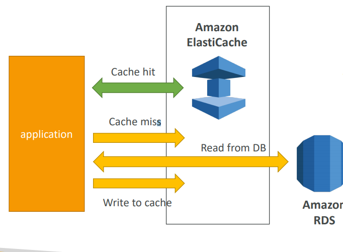
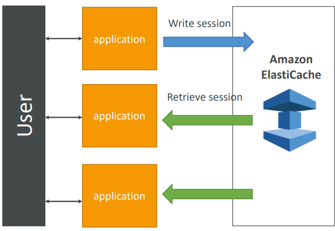
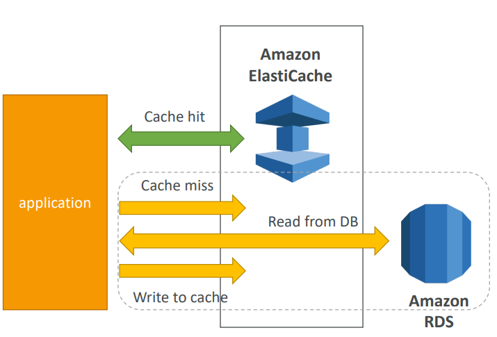
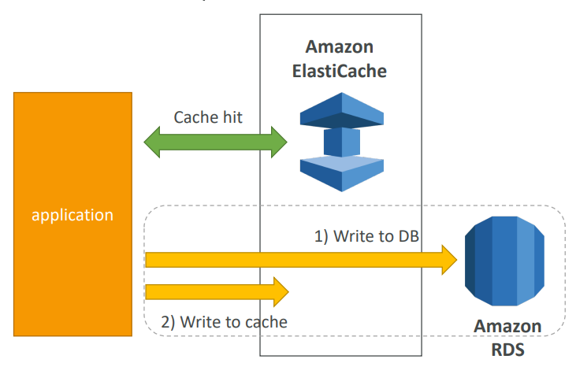

# ElastiCache

ElastiCache is to get __managed Redis or Memcached__ the same way RDS is to get managed Relational Databases.

* Caches are in-memory databases with really high-performance and low latency
* Helps reduce load off of databases for read intensive workloads
* Helps make your application stateless
* Write Scaling using _Sharding_
* Read Scaling using Read Replicas
* Multi AZ with Failover Capability

As with RDS, AWS takes care of OS maintenance, patching, optimizations, configuration, monitoring, failure recovery and backups.

## TOC

* DB-Cache Architecture
* User-session Architecture
* Redis & Memcached overview
* ElastiCache Patterns
	* Lazy Loading
	* Write Through

## Solution Architecture - DB Cache

Applications queries ElastiCache, if not available, get from RDS and store in ElastiCache. This helps relieve load in RDS.

Cache must have an invalidation strategy to make sure only the most current data is used in there.

## Solution Architecture - User Session Store

User logs into any of the application's instances, which writes the session data into ElastiCache. The user hits another instace of our application, and it retrieves the session data so the user is already loggd in.

## Redis Overview

Redis is an in-memory _key-value_ store.

* Super low latency (sub ms)
* Cache survives reboots by default (_persistence_)
* Great to host:
	* User sessions
	* Leaderboards
	* Distributed states
	* Relieve presure on databases
	* Pub/Sub capability for messaging
* Multi AZ with Automatic Failover for disaster recovery if you don't want ot lose your cache data
* Support for Read Replicas

## Memcached Overview

Memcached is an in-memory _object_ store.

* Cache doesn't survive reboots
* Great to host:
	* Quick retrieval of objects from memory
	* Cache often accessed objects

## ElastiCache Patterns

ElastiCache is helpful for:
* read-heavy application workloads
* compute-intensive workloads

There are two patterns / cache strategies for ElastiCache:
* Lazy Loading
* Write Through

### Lazy Loading - Load only when necesary

Pros:
* Only requested data is cached.
* Node failures are not fatal (just increased latency to warm the cache).

Cons:
* Cache miss penalty that results in 3 round trips, so noticable delay for request.
* __Stale data__: data can be updated in database and outdated in cache.

### Write Through - Add or Update cache when database is updated

Pros:
* Data in cache is __never stale__.
* Write penalty vs Read penalty (each write requires 2 calls).

Cons:
* Missing data until it is added/updated in the DB. Mitigation is to implement Lazy Loading strategy as well.
* Cache __churn__, a lot of data will never be read.
