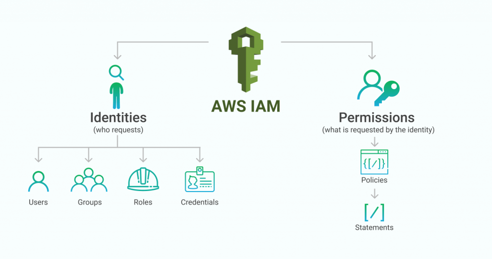
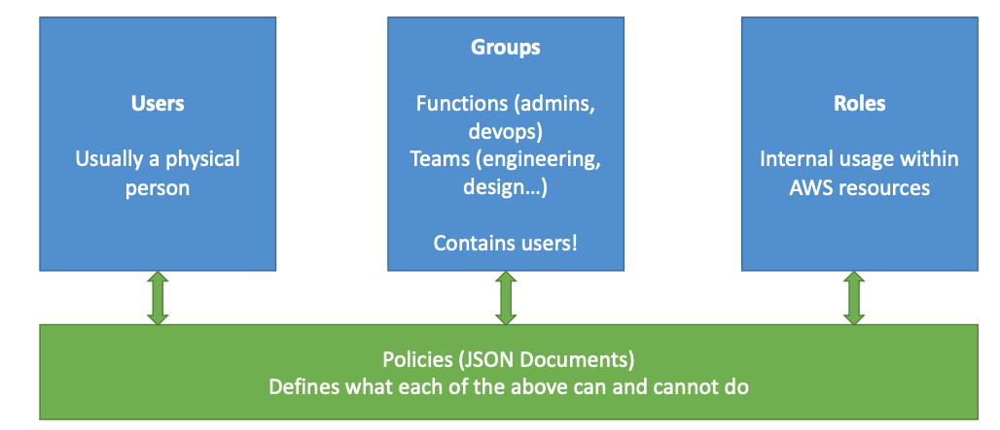

# IAM

* Identity and Access Management
* Whole AWS security is here
* IAM has a __GLOBAL__ view
* MFA (Multi Factor Authentication) can be setup
* _Least privilege principles_

## Best Practices

* Only 1 IAM User per PHYISICAL PERSON
* Only 1 IAM Role per Application
* IAM Credentials should __never be shared__
* IAM Credentials should never be written in code
* Root credentials should only be used for initial setup

