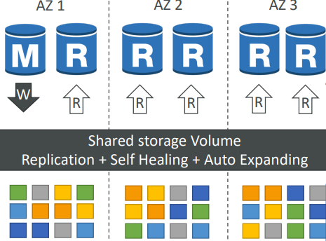
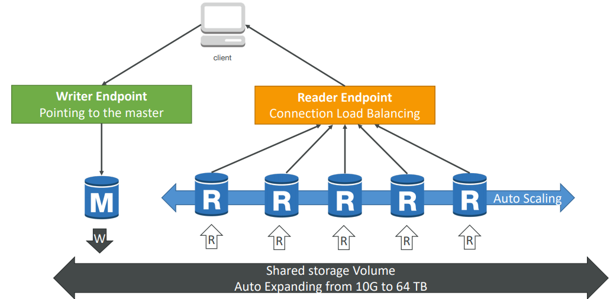
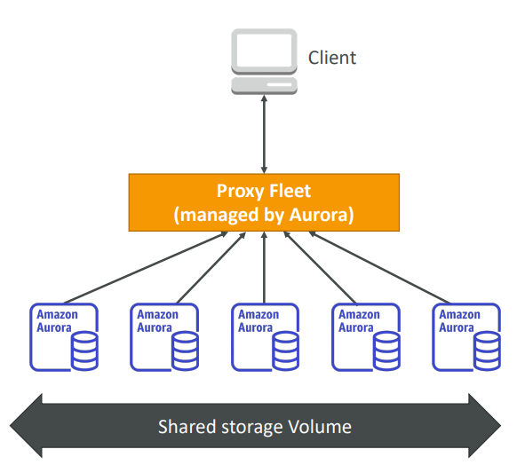
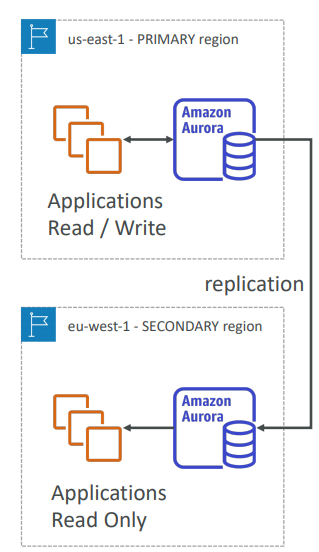

# AuroraDB

Aurora is a proprietary technology from AWS, a "AWS Cloud Optimized" database, that claims 5x performance impovement over MySQL on RDS, and over 3x the performance of Posgres on RDS.

#### Overview

* AuroraDB's drivers will work as if Aurora was a Postgres or MySQL database.
* Storage automatically grows in increments of 10GB, up to 64TB.
* Aurora can have 15 replicas while MySQL has 5, and the replication process is faster.
* Failover in Aurora is instantaneous (High Availability HA native).
* Aurora costs more than RDS (20% more) but is more efficient.

## AuroraDB High Availability and Read Scaling

* 6 copies of your data across 3AZ:
  * 4 copies out of 6 needed for writes
  * 3 copies out of 6 needed for reads
  * Self healing with peer-to-peer replication
  * Storage is striped across 100s volumes
* One Aurora Instance takes writes (master)
* Automated failover for master in less than 30 seconds
* Master + up to 15 Aurora Read Replicas serve reads
* Support for Cross Region Replication

## AuroraDB Cluster

## Features

* Automatic fail-over
* Backup and Recovery
* Isolation and Security
* Industry Compliance
* Push-button scaling
* Automated Patching with Zero Downtime
* Advanced Monitoring
* Routine Maintenance
* Backtrack: restore data at any point of time without using backups

## Security

* Similar to RDS because it uses the same engines
* Encryption at rest (KMS) and in flight with SSL
* Automated backups, snapshots and replicas are also encrypted
* Possibility to authenticate using IAM Token, such as with RDS
* You are responsible for protecting the instance with Security Groups
* Can't ssh

## Serverless

* Automated database instantiation and auto-scaling based on actual usage
* Good for infreuqent, intermittent or unrpedicable workloads
* No capacity planning needed
* Pay per second, can be more cost-effective

## Global Aurora

#### Cross Region Read Replicas

* Useful for Disaster Recovery
* Simple to put in place

#### Global Database (recommended)

* 1 Primary Region (read/write)
* Up to 5 secondary (read-only) regions, with replication lag less than 1 second
* Up to 16 Read Replicas per secondary region
* Helps for dereasing latency
* Promoting another region (for disaster recovery) has an RTO of less than 1 minute