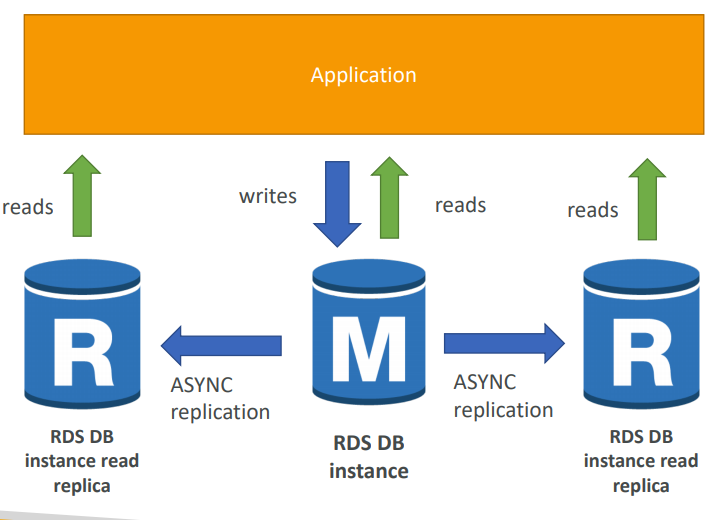
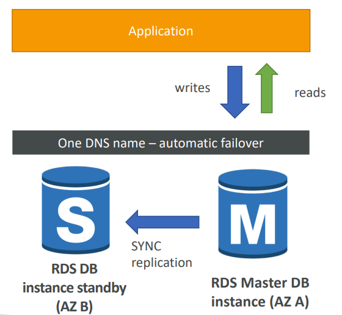

# RDS - Relational Database Service

It allows you to create databases in the cloud that are managed by AWS:
* Postgres
* Oracle
* MySQL
* MariaDB
* Microsft SQL Server
* Aurora (AWS Proprietary database)

#### Must know

* RDS vs Deploying DB on EC2
* Read Replicas
* Disaster Recovery
* Backups
* Snapshots
* Encryption
	* At Rest
	* In Flight
* Security
* RDS Aurora

## Advantages vs deploying DB on EC2

Managed service means:
* OS Patching level
* Continuous backups and restore to specific timestamp (_Point in Time Restore_)
* Monitoring dashboards
* Read replicas for improved read performance
* Multi AZ setup for DR (_Disaster Recovery_)
* Maintenance windows for upgrades
* Scaling capability (Vertical and Horizontal)

## Disadvantages vs deploying DB on EC2

You can't SSH into your instances.

## RDS Read Replicas

You can have __up to 5 Read Replicas__.

* Within AZ, Cross AZ or Cross Region.
* Replication is __ASYNC__, so reads are eventually consistent.
* Replicas can be promoted to their own DB.
* Applications must update the connection string to leverage read replicas.

#### Read - Replicas Network Cost

In AWS, there's a network cost when data goes from one AZ to another. To reduce the cost, you can have your Read Replicas in the same AZ.

#### Read Replicas - Use Cases

* Production database taking on normal load
* You want to run a reporting application to run some analytics
* You create a Read Replica to run the new workload there
* Production applications is unaffected
* Read Replicas are used for SELECT(=read) only kind of statements.

## RDS Multi AZ (Disaster Recovery)

* __SYNC__ replication
* One DNS name - automatic app failover to standby
* Increase __availability__
* Failover in case of loss of AZ, loss of network, instance or storage failure
* No manual intervention in apps
* Not used for scaling

## RDS Backups

Backups aure __automatically enabled__ in RDS.

* Daily full snapshot of database
* Capture transaction logs in real time
* Ability to restore to any point of time
* 7 days retention (can be increased to 35 days)

## RDS Snapshots

* Manually triggered by the user
* Retention of snapshot as long as you want

## RDS Encryption

* Can encrypt at rest or in flight
* Encryption has to be defined at launch time
* If master is not encrypted, read replicas cannot be encrypted
* To encrypt an un-encrypted RDS database:
	* Create a snapshot of it, copy it and enable encryption for snapshot.
	* Restore datase from encrypted snapshot
	* Migrate applications to new database and delete the old one.

#### Encryption - At Rest

* Possibility to encrypt master & read replicas with AWS KMS - AES-256 encryption.
* TDE (Transparent Data Encryption) available for Oracle and SQL Server

#### Encryption - In Flight

* SSL Certificates to encrypt data to RDS in flight
* To _enforce_ SSL:
	* __PostgreSQL__: `rds.force_ssl=1` in Parameter Groups
	* __MySQL__: within the DB, `GRANT USAGE ON *.*TO 'mysqluser'@'%' REQUIRE SSL;`
* To _connect_ using SSL:
	* Provide the SSL Trust certificate (can be downloaded from AWS)
	* Provide SSL options when connecting to database

## RDS Security

* RDS databases are usually deployed within a private subnet, not in a public one.
* Leveraging Security Groups (as with EC2 instances), controlling who can _communicate_ with RDS.
* IAM policies help control who can _manage_ AWS RDS.
* Traditional username and password can be used to _login_ to the database.
* IAM users be used too (for MYSQL / PostgreSQL/ Aurora)
	* It works by using an authentication token obtained through IAM & RDS API calls, and has a lifetime of 15 minutes.

## RDS vs Aurora

* Aurora is a proprietary technology from AWS.
* Postgres and MySQL are both supported as Aurora DB, this means your drivers will work as if Aurora was a Postgres or MySQL database.
* Aurora is "__AWS cloud optimized__" and claims 5x __performance improvement__ over MySQL on RDS, and over 3x the performance of Postgres on RDS.
* Aurora storage automatically grows in increments of 10GB, up to 64TB.
* Aurora can have 15 replicas whle MySQL has 5, and __the replication process is faster__.
* Failover in Aurora is instantaneous and HA native.
* Aurora costs more (20%) than RDS, but it's more efficient.
