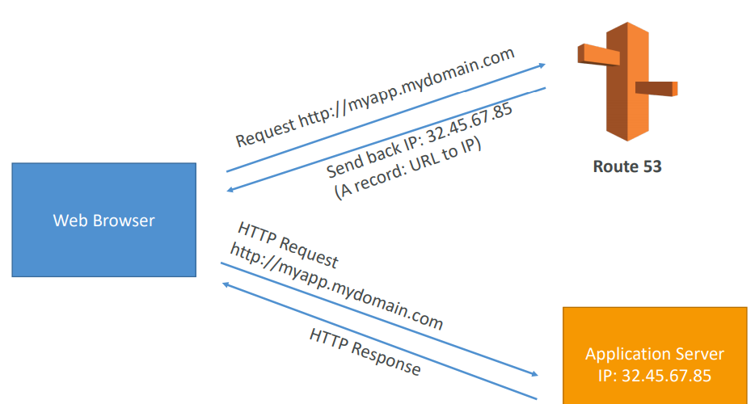
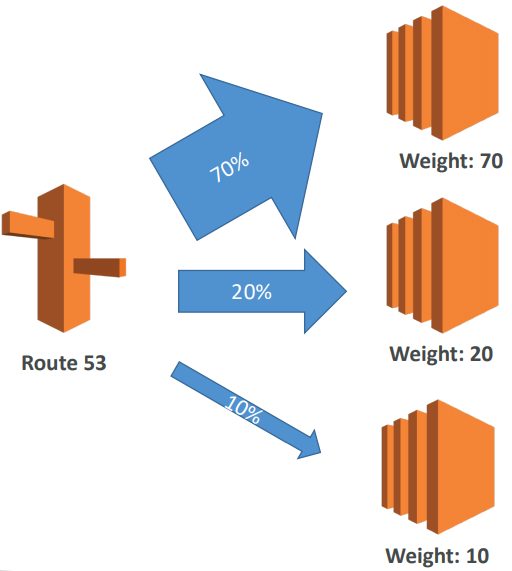
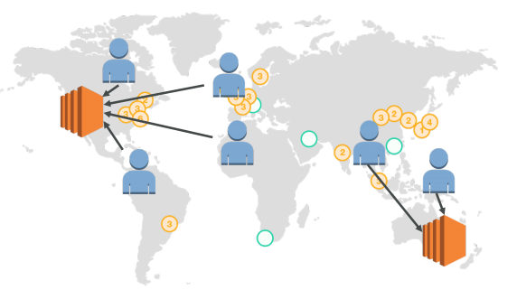
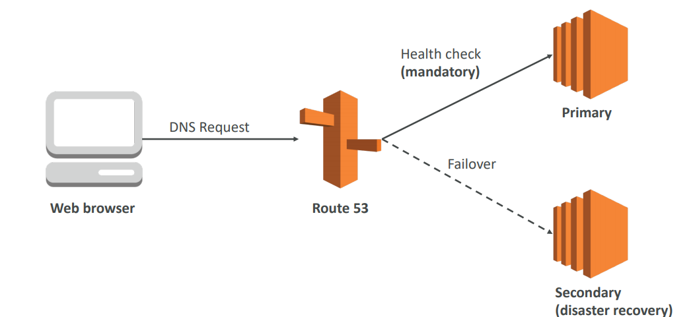
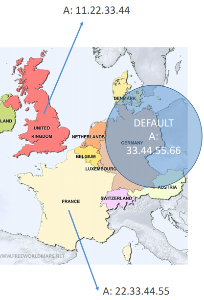

# Route 53

Route53 is a Managed DNS, a collection of rules and records which helps clients understand how to reach a server through URLs.

## AWS Common Records

* __A__: URL to IPv4
* __AAAA__: URL to IPv6
* __CNAME__: URL to URL
* __Alias__: URL to AWS Resource
	* Prefer Alias over CNAME for AWS resource (better performance)

## Overview

#### Domain Names

Route53 can use:
* Public domain names.
* Private domain names (that can be resolved by your instances in your VPCs).

## Advances Features

* Load Balancing (through DNS - client load balancing)
* Health Checks
* Routing Policy:
	* Simple
	* Failover
	* Geolocation
	* Geoproximity
	* Latency
	* Weighted	

#### Weighted

Control the % of the requests that go to specific endpoint. It's helpful for example to split traffic between to regions, or to test a small segment on a new app verson.

Can be associated with Health Checks.

#### Latency

Redirect to the server that has the least latency close to use. Super helpful when latency of users is a priority.

Latency is evaluated in terms of uer to designated AWS Region.

#### Failover

#### Geolocation

This routing is based on user location instead of latency. We specify that traffic for a specific location, should go to a specific IP.

Should create a "default" policy in case there's no match on location.

#### Multi Value Routing Policy

Use when routing traffic to multiple resources and want to associate Route 53 Health Checks with Records.

Up to 8 healthy records are returned for each Multi Value query.