# S3 - Buckets

> S3 allows people to store objects (files) in "buckets" (directories).

* Overview
* Versioning
* Encryption
* Security
    * User based
    * Resource based
* Policies
* Other Security Concerns
    * Networking
    * Logging and Audit
    * User Security
* Static websites
* CORS
* Consistency Model
* Performance
* Storage Classes
    * Standard - General Purpose
    * Standard-Infrequent Access (IA)
    * One Zone-Infrequent Access
    * Intelligent Tiering
    * Glacier
    * Glacier Deep Archive
* S3 & Glacier Select
* Transition between storage classes
* Replication
* Pre-Signed URLS
* Event Notifications
* S3 Object Lock & Glacier Vault Lock

#### Overview

* Buckets must have a __globally unique name__.
* Buckets are defined at the __region level__.
* Naming conventions
    * No uppercase
    * No underscore
    * 3-63 characters long
    * Not an IP
    * Must start with lowercase letter or number
* Objects (files) have as key the __full path__.
* There's no concept of "directories" within buckets altough UI will trick you to think otherwise.
* __Versioning__
* __Encryption__

#### Object values

* Object Values are the content of the body:
    * Max Size is 5TB
    * Uploading more than 5GB, must use "multi-part upload"
* Metadata (list of text key/value pairs, system or user metadata)
* Tags (Unicode key/value pair, up to 10, useful for security/lifecycle)
* Version ID (if versioning is enable)

---

## Versioning 

* You can version your files in S3
* Enabled at the __bucket level__
* Same key overwrite will increment the version: 1, 2, 3...
* It is a __best practice__ to version your buckets
    * Protects against unintended deletes
    * Easy roll back to previous version
* Any not versioned file prior to enabling versioning, will have version "null"

## Encryption

There are 4 methods that adapt better to different situations:

#### SSE-S3

* Using keys handled & managed by AWS
* Server Side
* AES-256 encryption type
* Must set header: `x-amz-server-side-encryption: AES256` 

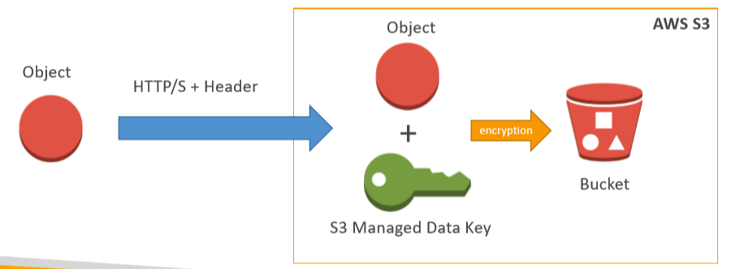

#### SSE-KMS:

* Leverage AWS Key Management System to manage encryption keys
* Server side
* KMS Advantages: user control + audit trail
* Must set header: `x-amz-server-side-encryption: aws:kms`

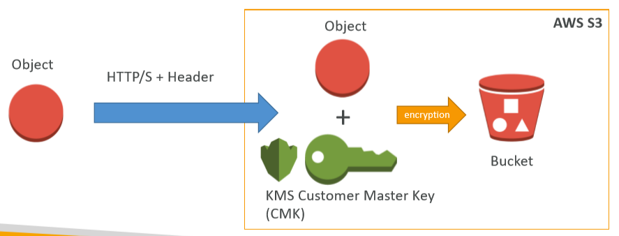

#### SSE-C

* When you want to manage your own encryption outside of AWS
* S3 does not store te encryption key you provide
* HTTPS must be used
* Encryption key must e provided in HTTP headers for every request made

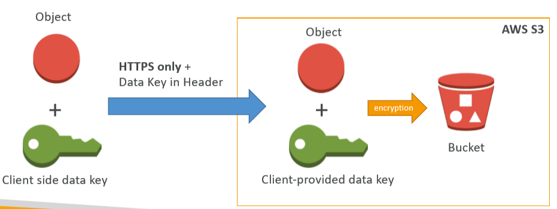

#### Client Side Encryption

* Client library such as the Amazon S3 Encryption Client
* Clients must encrypt data themselves before sending to S3
* Clients must decrypt data themselves when retrieving from S3
* Customer fully manages the keys and encryption cycle

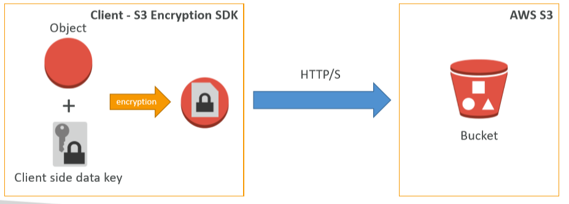

## Encryption in Transit

AWS S3 Exposes:
* HTTP endpoint: not encrypted
* HTTPS endpoint: encryption in flight (__SSL/TLS__)

You are free to use the endpoint you want, but https is recommended and mandatory for SSE-C.

## Security

* User based
* Resource based

#### User based

IAM Policies control which API calls should be allowed for a specific user from IAM console.

#### Resource based

* Bucket policies: wide rules from the S3 console
* Object Access Control List (ACL): finer grain
* Bucket Access Control List (ACL): less common

## Bucket Policies

#### JSON based policies

* Resources: buckets and objects
* Actions: Set of API to Allow or Deny
* Effect: Allow/Deny
* Principal: Account or user to apply the policy to

#### Usage

* Grant public access to the bucket
* Force objects to be encrypted at upload
* Grant access to another account (Cross Account)

## Other Security Cocnerns

#### Networking

Supports VPC Endpoints (without 'www')

#### Logging and Audit

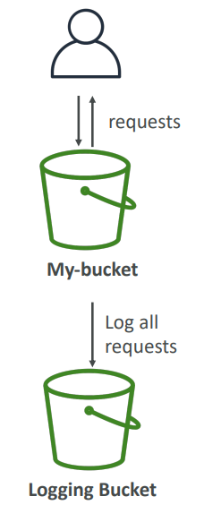

* S3 access logs can be stored in other S3 bucket (if you use same bcket, it will create a logging loop...)
    * Including denied requests.
* API calls can be logged in AWS _CloudTrail_
* Data can be analyzied using data analysis tools or __Amazon Athena__.

#### User Security

* __MFA__ (Multi Factor Authentication) can be required in versioned buckets to delete objects.
* __Signed URLs__: URLs that are valid only for a limited time.

## S3 Websites

* S3 can host static websites and have them accessible on the www
* 403 error: make sure the bucket policy allows public reads!

## S3 CORS

* If you request data from another S3 bucket, you need to enable CORS
* Cross Origin Resource Sharing allows you to limit the number of websites that can request your files in S3 (and limit your costs)

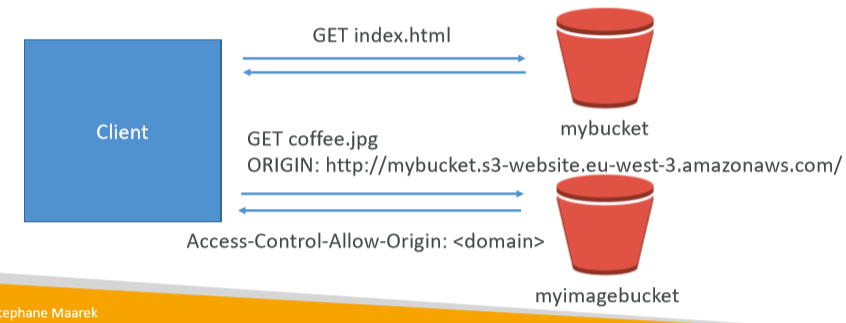

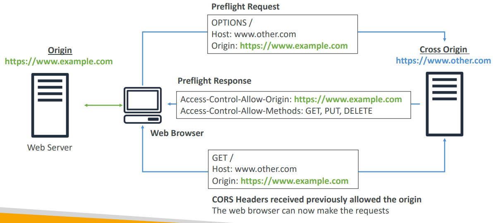

## Consistency Model

* __Read after write consistency for PUTS of new objecs__
    * As soon as object is written, we can retrieve it (ex: PUT 200 -> GET 200)
    * This is true, __except__ if we did a GET before to see if the object existed (GET 404 -> PUT 200 -> GET 404)
* __Eventual Consistency for DELETES and PUTS of existing objects__
    * If we read an object after updating, we might get older version (PUT 200 -> PUT 200 -> GET 200 (might be older version))
    * If we delete an object, we might still be able to retrieve it for a short time (DELETE 200 -> GET 200)

## Other

* S3 can __send notification on changes__ to:
    * AWS SQS: queue service
    * AWS SNS: notification service
    * AWS Lambda: serverless service
* S3 has a cross origin __replicatino feature__ (managed)

## Performance Historically

* When you had > 100 TPS, S3 performance could degrade
* Behind the scene, each object goes to an S3 partition adn for the est performance, we want the highest partition distribution
* In the exam, and historically, it was recommended to have random characters in front of your key name to optimize performance.
* It was recommended never to use dates to prefix keys.

## Current Performance

* As 2018, you could scale up to 3500 RPS for PUT and 5500 RPS for GET for EACH PREFIX
* This S3 request rate performance increase __removes any previous guidance to randomize object prefixes to achieve faster performance__.
* For uploading large objects (>= 100MB), use __multipart upload__
    * parallelizes PUTs for greater throughput
    * maximize network bandwith and efficiency
    * decrease time to retry in case a pat fails
    * __Must__ use multipart if object size is greater than 5GB
* CloudFront to cache S3 objects around the world (improves reads)
* S3 Transfer Acceleration (uses edge locations), just need to change the endpoint you write to.
* If using SSE-KMS encryption, you may be limited to your AWS limits for KMS usage (~100 - 1000 downloads / uploads per second)

## Storage Classes

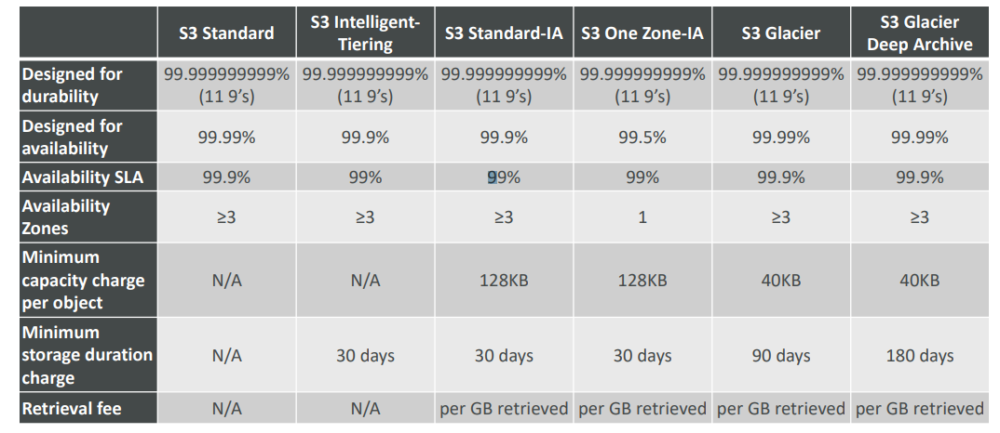

## S3 & Glacier Select

With S3 Select / Glacier Select, you can SQL _SELECT_ queries ot let S3 or Glacier know exactly which attributes/filter you want, this is useful when you want to retrieve only a __subset__ of data.

* Glacier is __another S3 storage tier__ for long term archival.
* Save up to 80% and increase performance by 400%
* Works with files in CSV, JSON or Parquet format
* Files can be compressd with GZIP or BZIP2
* No subqueries or Joins are supported

## Transtion beteen storage classes

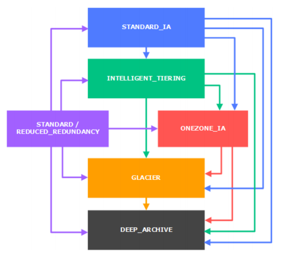

You can transition objects between storage classes:
* Infrequently accessed object -> STANDARD_IA
* Archive objects you don't need in real-time -> GLACIER or DEEP_ARCHIVE

Moving objects can be automated using a __lifecycle configuration__.

#### S3 Lifecycle Rules

* __Transition Actions__: defines when objects are transitioned to anoter storage class.
    * Move objects to STANDARD_IA 60 days after creation
    * Move to Glacier for achiving after 6 months
* __Expiration Actions__: configure objects to expire (delete) after some time.
    * Access log files can bet set to delete after 365 days
    * Can be used to delete __old versions__ of files (if versioning is enabled)
    * Can be used to delete incomplete multi-parts uploads.

Rules can be created for a __certain prefix__ (ex - s3://mybucket//myfolder/*) and for __certain objects tags__ (ex: Departament: MyDepartment).

## S3 Replication (CRR & SRR)

* __Must enable versioning__ in source and destination
* Cross Region Replicaton (CRR)
    * Compliance
    * Lower latency access
    * Replication across accounts
* Same Region Replication (SRR)
    * Log aggregation
    * Live replication between production and test accounts
* Buckets can be in different accounts
* Copying is __asynchronous__
* Must give proper IAM permissions to S3
* After activating, __only new objects are replicated (not retroactive)__
* There is no "chaining" of replications (not transitive)

## Pre-Signed URLs

You can generaet pre-signed URLs using SDK or CLI for __downloads (CLI) & uploads (SDK)__.

They are valid for a default of 3600 seconds, can change timeout with `--expires-in <SECONDS>`.

Users given a pre-signed URL inherit the permissions of the person who generated the URL for GET/PUT.

#### Use cases

* Allow only logged-in users to download a premium video on your S3 bucket
* Allow an ever changing list of users ot download files by generating URLs dynamically
* Allow temporarily a user to upload a file to a precise location in our bucket

## Event Notifications

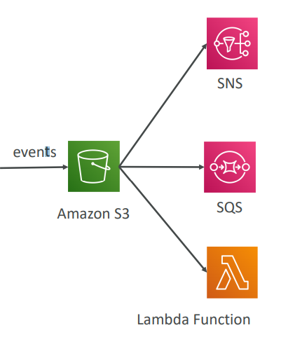

S3 event notifications typically deliver events in seconds but can sometimes take a minute or longer. 

If you want to ensure that an event notification is sent for every successfull write, you can enable versioning on your bucket. If two writes are made to a single non-versioned object at the same time, it is possible that only a single event notification will be sent.

Examples:
* S3:ObjectCreated
* S3:ObjectRemoved
* S3:ObjectRestore
* S3:Replication

Features:
* Object name filtering possible (*.jpg)
* Use case: generate thumbnails of images upladed to S3
* __Can create as many "S3 Events" as desired

## S3 Object Lock & Glacier Vault Lock

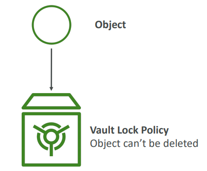

Adopt a __WORM (Write Once Read Many)__ model, by blocking an object version deletion for a specified amount of time.

Glacier Vault Lock follows the same approach but by blocking the policy for future edis.

__Helpful for compliance and data retention__.
