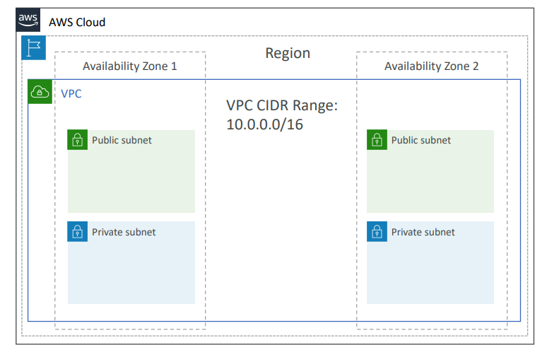
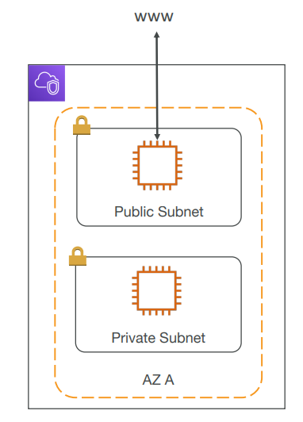
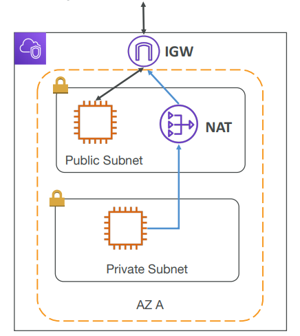
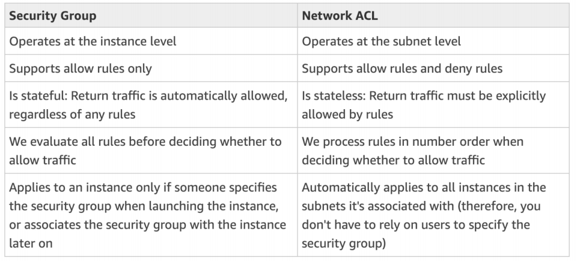
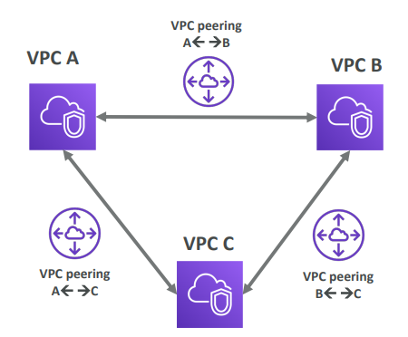
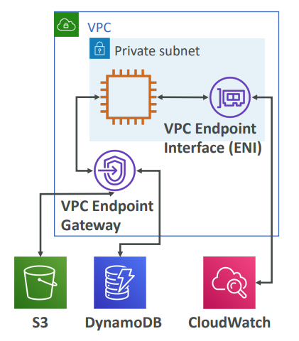
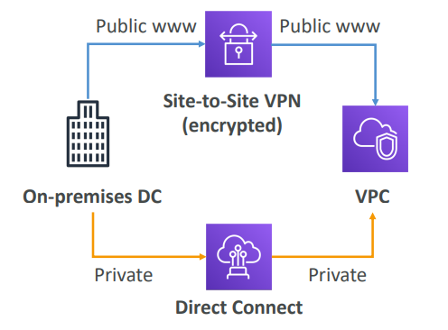
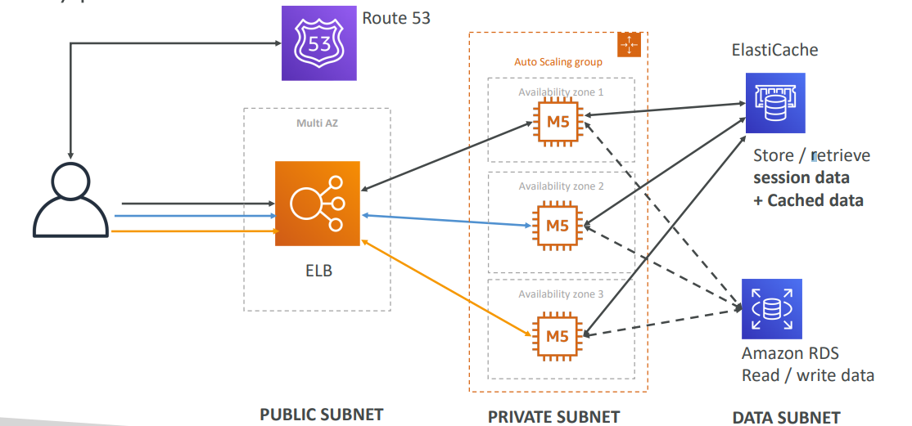
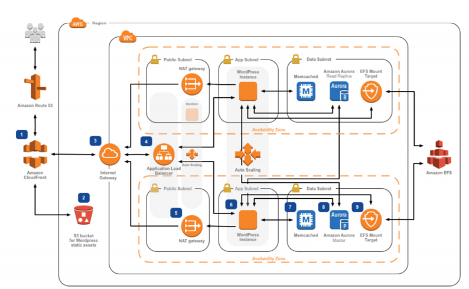

# VPC - Virtual Private Cloud

* __VPC__ is a private network to deploy your regional resources.
* __Subnets__ allow you to partition your network inside your VPC.
* __Public Subnet__ is a subnet that is accessible from the internet.
* __Private Subnet__ is a subnet that is not accessibel from te internet.

#### Public Subnets

Usually contains:
* Load Balancers
* Static Websites
* Files
* Public Authentication Layers

#### Private Subnets

Usually contains:
* Web application servers
* Databases

## Must Know

* How to use it?
* Internet Gateways & NAT Gateways
* NACL vs Security Groups
* Flow Logs
* Peering
* Endpoints
* Site to Site VPN & Direct Connect

## How to use it?

Within a Region, you are able to create VPCs. To define access to the internet and between subnets we use __Route Tables__.

* Each VPC contains subnets (networks)
	* Each subnet must be mapped to an AZ
	* It's common to have both a public subnet (public IP) and private subnet (private IP)
	* It's common to have many subnets per AZ
* Public and Private Subnets __can communicate if they're in the same VPC__.

## Internet Gateway & Nat Gateways

__Internet Gateways__ helps ou VPC instances connect with the internet. Public Subnets have a route to the internet gateway.

__NAT Gateways__ (AWS-managed) & __NAT Instances__ (self-managed) allow your instances in Private Subnets to acces the internet while remaining private.

## Network ACL & Security Groups

__NACL__ is a firewall which controlls traffic from and to subnet (ALLOW/DENY rules that only include IP addresses), and is attached at the Subnet level.

__Security Groups__ are a firewall that controls traffic from and to an ENI / EC2 Instance. Can only have ALLOW rules, and rules include IP addresses or other Security Groups.

## VPC Flow Logs

* Capture information abotu IP traffic going into your interfaces.
* Helps to monitor & troubleshoot connectivity issues.
* Captures network information from AWS managed interfaces too (ELB, ElastiCache, RDS, etc...)
* VPC Flow logs data can go to S3 / CloudWatch logs.

## Peering

Connect two VPC privately using AWS network. You can make tem behave as if they were in the same network.

Must not have overlaping CIDR (IP address range).

VPC Peering connection is __not transitive__, meaning it must be established for each VPC that need to communicate with one another.

## Endpoints

Endpoints allow you to connect to AWS Services using  __private network__ instead of the public www network.

__It can only be used within your VPC__.

This gives you enhanced security and lower latency to access AWS Services.

* VPC Endpoint Gateway: S3 & DynamoDB
* VPC Endpoint Interface (__ENI__): Rest

## Site-to-Site VPN & Direct Connect

__Site-to-Site VPN__ allows to connect an on-premise VPN to AWS. The conncetion is automatically encrypted and goes over the public internet.

__Direct Connect (DX)__ establish a physical connection betwen on-premises and AWS. The connection is private, secure and fast. Goes over a private network. It takes at least a month to establish.

__Site-to-Site VPN and DX cannot access VPC endpoints__.

## VPC Brain Dump

* All new accounts come with a default VPC.
* It's possible to use a VPN to connect to a VPC, and access all the private IPs.
* VPC's __Flow Logs__ allow you to monitor the traffic within, in and out of your VPC.
	* Security
	* Performance
	* Audits
* VPC are __per Account per Region__.
* Subnets are __per VPC per AZ__.
* Some AWS resources can be deployed in VPC while others can't.
* You can peer VPC (within or across acounts) to make it look like they're part of the same network.

## Typical Web App 3-tier Architecture

## Wordpress example

