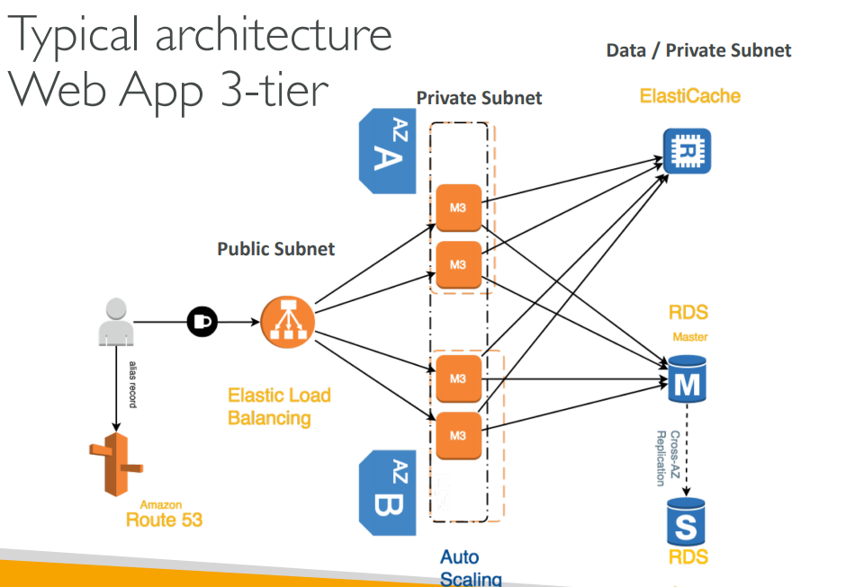

# VPC - Virtual Private Cloud

Within a Region, you are able to create VPCs.

* Each VPC contains subnets (networks)
	* Each subnet must be mapped to an AZ
	* It's common to have both a public subnet (public IP) and private subnet (private IP)
	* It's common to have many subnets per AZ
* Public and Private Subnets __can communicate if they're in the same VPC__.

#### Public Subnets

Usually contains:
* Load Balancers
* Static Websites
* Files
* Public Authentication Layers

#### Private Subnets

Usually contains:
* Web application servers
* Databases

## VPC Brain Dump

* All new accounts come with a default VPC.
* It's possible to use a VPN to connect to a VPC, and access all the private IPs.
* VPC's __Flow Logs__ allow you to monitor the traffic within, in and out of your VPC.
	* Security
	* Performance
	* Audits
* VPC are __per Account per Region__.
* Subnets are __per VPC per AZ__.
* Some AWS resources can be deployed in VPC while others can't.
* You can peer VPC (within or across acounts) to make it look like they're part of the same network.

## Typical Web App 3-tier Architecture

