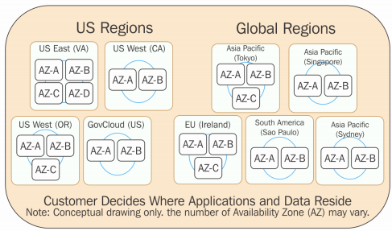

# AWS Regions

* Regions all around the world (i.e, us-east-1)

* Each region has __availability zones__ (us-east-1a, us-east-1b..), and each one of those is a physical data center in the region.

### Services are Region Scoped

All services are region scoped __EXCEPT__:

* IAM
* S3
* Route53
