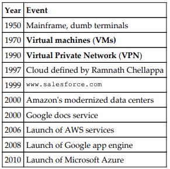

# Introduction

## History of the Cloud

## Welcome to AWS

AWS is a public cloud, where all services are provided on a pay as you go model. Cloud computing enables the organizations to focus on their actual business rather than periodically getting engaged in upgrading existing IT infrastructure to design cutting-edge solutions to compete with their competitors in the markets. You have a virtually unlimited pool of resources as and when it is required to expand IT infrastructure for short or long-term needs.

AWS provides a range of IT services that can be used as building blocks for creating robust and scalable enterprise-grade solutions. It can be used to host everything from simple static websites to complex three-tier architectures, scientific applications to modern ERPs, online training to live broadcasting events.

## AWS vs Traditional Data Center

#### Switch Capital Expenditure (CapEx) to Operational Expenditure (OpEx)

No need to bear the huge upfront cost of purchasing hardware or software, pay only for what services you use on a monthly basis as OpEx.

#### Cost benefit from massive economies of scale

Since AWS purchases everything in bulk, it gives them a cost advantage that passes to their customers by offering services at low cost. As cloud becomes larger and larger, so scale benefits for end customers

#### No need to guess required infrastructure capacity

Guessing requirements lead to scarcity or wastage of resource when actual production begins. Scale environment up or down as needed.

#### Increase speed and agility

While building an on-premises data center, businesses have to wait to get desired hardware or software from vendors. It becomes easier for business to quickly get started and provision the required infrastructure on AWS immediately without depending on third party vendors.

#### Global access

AWS has data centers and edge locations across the globe. Host your infrastructure near to your target market or at multiple location.

## Cloud Computing Models

* IaaS
* PaaS
* SaaS

#### IaaS - Infrastructure as a Service

Virtualized hardware or computing infrastructure as a service.

#### PaaS - Platform as a Service

Application platforms and tools over the cloud, usually to enable application development. Underlined hardware and software are hosted on the service provider’s infrastructure.

#### SaaS - Software as a Service

Software or applications hosted by the providers and the end customer simply consumes this service without worrying about underlying hosting platform, infrastructure, and maintenance.

## Virtualization

Virtualization is a process of virtually segregating physical hardware resources into a set of virtual resources that can independently work as a computing resource and provide customized and dedicated CPU, RAM, storage, and so on. Each server and its resources is created in an isolated environment, abstracted from a physical operation system and underlying hardware configuration. Such resources are called VMs or instances.

Virtualization is achieved using virtualization software that maintains the abstract and virtual layers on top of physical hardware.

## Virtualization method categories

#### OS-level virtualization

Host machine and VMs have same OS with same patch level.

* BSD Jail
* Docker
* Solaris Containers

#### Software virtualization (hypervisor):

* __Binary translation__: Sensitive instructions of VMs are replaced by hypervisor calls.
* __PVM - Para Virtualization Mode__: Guest OS, specially drivers, are modified to deliver performance.
* __HVM - Hardware Assisted Virtual Machine__: Abstract layer between host and guest VMs. Uses CPU’s special instruction sets (Intel-VT and AMD-V) to boost guest VMs performance.

#### Hardware emulation

Makes it possible to run unsupported OS, such as Android on a PC

## Elasticity

In cloud infrastructure, elasticity can be defined as the ability to automatically provision additional resources to meet the high demand and reducing the extended number of resources when the demand lowers.

## Scalability

Adding resources either to the existing instance (scale up) or in parallel to a new instance (scale out). It is essential to achieve elasticity.

#### Scale up / Vertical Scaling

Changing instance type from small to large is called scaling up. It is also called Vertical Scaling. It may require stopping existing and running instance. Scaling up is usually suggested for an application that does not support clustering mode easily such as RDBMS. This is usually achieved manually and requires downtime.

#### Scale out / Horizontal Scaling

Placing one or more new instances parallel to the existing one. It is also referred to as Horizontal Scaling. It gives good performance and availability as instances can be placed across multiple AZs. By having individual resources such as NIC and disk controller for each instance, much better performance can be achieved compared to scaling up. Scaling out is usually suggested for clustering enabled applications such as stateless web servers, big data, and NoSQL. This generally does not require any downtime.

## Resourcing (Traditional vs Cloud Computing)

## Shared Security Responsibility Model

## How to access AWS Services?

* AWS Management Console
* AWS CLI
* AWS SDKs
* Query APIs

#### AWS Management Console

Browser-based GUI to manage AWS resources

#### AWS CLI

Individual sets of commands available for each AWS services, mostly use for administration activities

#### AWS SDKs

Take complexity out of the coding by providing SDKs for a number of programming languages including:
* Python
* Node.js (Javascript)
* PHP
* .NET
* Ruby
* Go
* Java

#### Query APIs 

HTTP endpoints to send GET and PUT requests for obtaining present status and information for various AWS resources
